# RCET Flowcharts for Program Design and Documentation

> A useful flowchart shows an algorithm clearly enough that another person can trace, implement, explain, and troubleshoot it. This guide brings together flowchart design principles, RCET documentation expectations, and complete authoring instructions.

Read sections [1](#1-purpose-and-rcet-expectations), [2](#2-from-requirements-to-an-algorithm), [3](#3-read-and-draw-a-basic-chart), [4](#4-sequence-decisions-and-loops), and [5](#5-trace-and-improve-the-design) for the foundations. Use [section 6](#6-choose-detail-and-manage-complexity) as your programs grow, [section 7](#7-handle-asynchronous-execution) when interrupts apply, and [section 8](#8-document-and-check-the-finished-work) to prepare and check your lab-book documentation. [Section 9](#9-author-with-your-selected-tool) contains the tool instructions; [Appendix A](#appendix-a-mermaid-syntax-lookup) is a stand-alone Mermaid syntax lookup. PIC examples are identified as RCET3375 examples so course-specific requirements remain clear.

The main lessons explain behavior and design choices. **RCET expectations** identify what the work must communicate, with preferences and assignment-dependent guidance distinguished at the start. **Tool instructions** explain how to draw and publish that work with your selected method.

## Table of contents

- [1. Purpose and RCET expectations](#1-purpose-and-rcet-expectations)
- [2. From requirements to an algorithm](#2-from-requirements-to-an-algorithm)
- [3. Read and draw a basic chart](#3-read-and-draw-a-basic-chart)
- [4. Sequence, decisions, and loops](#4-sequence-decisions-and-loops)
- [5. Trace and improve the design](#5-trace-and-improve-the-design)
- [6. Choose detail and manage complexity](#6-choose-detail-and-manage-complexity)
- [7. Handle asynchronous execution](#7-handle-asynchronous-execution)
- [8. Document and check the finished work](#8-document-and-check-the-finished-work)
- [9. Author with your selected tool](#9-author-with-your-selected-tool)
- [Conclusion](#conclusion)
- [Appendix A. Mermaid syntax lookup](#appendix-a-mermaid-syntax-lookup)

---

# 1. Purpose and RCET expectations

Start here to understand the purpose of the work, when to begin, and what the finished documentation must communicate.

## 1.1 Why create a flowchart?

A flowchart is a **thinking tool and a communication tool**.

It helps answer:

> **How does execution move through the solution?**

It can also expose problems in the design. If the program flow is difficult to represent clearly, the source code may also be more complicated than it needs to be. A confusing flowchart can be a clue that the algorithm should be simplified, reorganized, or divided into smaller pieces.

Clean, clear code is easier to test, explain, modify, and troubleshoot. The same is true of a flowchart.

## 1.2 When to begin

The flowchart should begin early enough to influence the design. It should then be updated as the design changes.

A flowchart created only after the program works can still be useful final documentation, but it has missed much of its value as a design and troubleshooting tool.

In RCET3375, flowcharts normally belong in **Before Lab** preparation. That does not mean the first version must survive unchanged. It means students should arrive with a meaningful design rather than beginning a substantial algorithm from scratch at the bench.

## 1.3 What you are expected to produce

A complete flowchart is the **linked set of readable charts** needed to describe the program at the required level of detail. It can occupy several pages. An excerpt helps explain a local section, but the complete chart set must still be available.

Use the assignment to determine which parts of the program need documentation and how much setup detail to show. The following distinctions apply throughout this guide:

| Status | What it means for your work |
| --- | --- |
| **Required** | Label decision outcomes, show the necessary decisions, make the chart readable, and keep the chart, pseudocode, comments, and final source consistent. Identify child charts and the complete chart behind an excerpt. |
| **Preferred convention** | Use top-to-bottom flow when it fits the algorithm, with consistent alignment and spacing. Left-to-right is acceptable when it is clearer; Yes and No have no required physical direction. |
| **Assignment-dependent** | Show setup at the level being learned. Include separate interrupt documentation when the program uses interrupts. The Before Lab expectation in [section 1.2](#12-when-to-begin) is specifically identified for RCET3375. |
| **Suggested practice** | Use the example lab-book organization as a model, and use a stencil when practical for hand-drawn work. The sample page numbers and a particular stencil brand are not requirements. |

RCET accepts draw.io, Mermaid, or a clean hand-drawn flowchart unless an assignment says otherwise. Choose the method that lets you revise and communicate the design clearly; the detailed instructions for each are in [section 9](#9-author-with-your-selected-tool).

---

# 2. From requirements to an algorithm

Describe the required behavior and meaningful tasks before choosing the exact source instructions. Revisit that description as the design develops.

## 2.1 Requirements, pseudocode, flowcharts, comments, and source code

These artifacts describe the same system at different levels.

| Artifact | Main question it answers |
| --- | --- |
| Requirements | What must the program accomplish? |
| TODO list / pseudocode | What sequence of meaningful tasks could accomplish it? |
| Flowchart | How can execution move through those tasks, decisions, and loops? |
| Code comments | Why does this section of code exist or what job does it perform? |
| Source code | Exactly how is the design implemented on this processor or in this language? |

They should agree, but they should **not duplicate each other line by line**.

A good code comment and a good flowchart block often operate at a similar level of abstraction.

Poor comment:

```text
Test bit 7. If set, set bit 7 in another register.
```

That merely restates operations already visible in the source.

Better comment:

```text
Remember that key 7 is currently active.
```

A matching flowchart might say:

```text
Is key 7 pressed?
       |
      Yes
       ↓
Set key 7 flag
```

The source code may implement that with bit tests, skips, branches, masks, and register writes. The flowchart and comment describe the **purpose** of those instructions.

## 2.2 The idealized development sequence

Programming texts often describe a clean progression such as:

```text
requirements
    ↓
pseudocode / algorithm planning
    ↓
flowchart
    ↓
source code
    ↓
test and debug
    ↓
final documentation
```

That sequence is useful because it emphasizes **thinking before typing code**.

It is also more orderly than real development usually is.

## 2.3 A practical iterative workflow

A common working method is:

1. Read the requirements.
2. Write a high-level TODO list in natural language.
3. Rearrange the list as the required sequence becomes clearer.
4. Break difficult list items into smaller steps.
5. When branching, looping, or repeated work becomes harder to keep in your head, add arrows or sketch part of a flowchart.
6. Begin writing code when enough of the design is clear to make progress.
7. Return to the TODO list, pseudocode, and flowchart whenever implementation exposes a missing decision, a better sequence, unnecessary complexity, or a useful subroutine.
8. Reconcile the final pseudocode, flowchart, comments, and source so they describe the same finished design.

In this workflow, **pseudocode usually begins before the flowchart**, but neither one must be completely finished before source code starts.

Work out the flowchart while writing the code. After adding a decision, loop, or routine, trace how execution enters it and where it continues. If that becomes hard to explain, revisit the design immediately. A small sketch can expose a misplaced operation or tangled branch before more code makes the problem harder to untangle. See [section 6.4.4](#644-when-tangled-flow-calls-for-refactoring) for a refactoring workflow.

[Open this diagram in Mermaid Live Editor](https://mermaid.live/edit#pako:eNpNkstu2zAQRX9lwLWM7r1oAMXIrjUSC3AK1YsJOZII86FyyCaG7X8vSTmNuSIHvGfuPM5CekViLQbj3-WEIULX_naQz0v_Qqgg0J-kA1lykQ-wWn2Hrt8HHQkmPU4rQ3_JQLfdbMFojvANZqakfMEeFlBXVduM80FRgIh8ZECGOBFwxpOTBG8kvSUGaQjDTbmtyrZvA-ERlB4GLZOJkLNbBu2iB7ZoTIZypJlvsrbKHs9tQCcn7UbwAYz3c7nWPOWSi1WQCZM3KrMgB9XDdSE8FsLlF_EFnvrdkaKcAEPw71xQCHNulEYD_7t2uNf99BfY35qUv1ufnZ_griNP1eB-eezr47XviGMDMaCkBtApUPSWxpvitX56Pm909mpnU-eBUXsH9DF7pmxKEevRQfbjxpo4OUeSmDGU7EX1oePps8bnrxq7-0hxv8vDkt5Jbehuns1XvU0B1p1YvA7a5XawT0GWIkUjLAWLWon1WeQ527JjigbM4xPXRmCKfndyUqxjSNSINCuMtNE4BrSfQVI6-vBjWdC6p9d_Befneg)

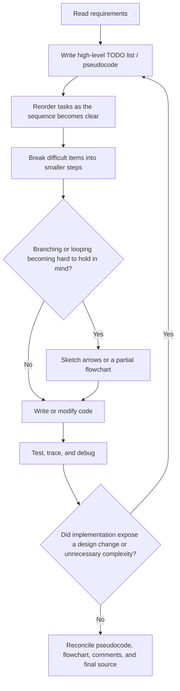

This is still design work. The important difference is that the design is **iterative rather than frozen**.

## 2.4 Flowchart the algorithm, not the syntax

Suppose source code tests an input bit and sets a flag.

The implementation might contain several low-level operations:

```text
select register bank
read an SFR
mask or test a bit
skip or branch
set a bit in a flag register
```

A poor flowchart simply turns those into English boxes.

A better flowchart asks what the code **means**:

[Open this diagram in Mermaid Live Editor](https://mermaid.live/edit#pako:eNpNj7sOgkAQRX9lMjXUJhSaKI2FNNgYtJjsDo_wWLI7GyXAv4uIibe89xTnjqiMZowwb8xTlWQFrsd7B0vi8eyg5gF20Ft2jvVh3hYIw_10YzdBmqUsG5U3VDz-icRMkGSnklUNHb9WbgEwwJZtS5XGaEQpuf0IaM7JN4JzgOTFpEOnMBLrOUDfaxKOKyostb-SdSXGXr7264n5DYlIQ7A)

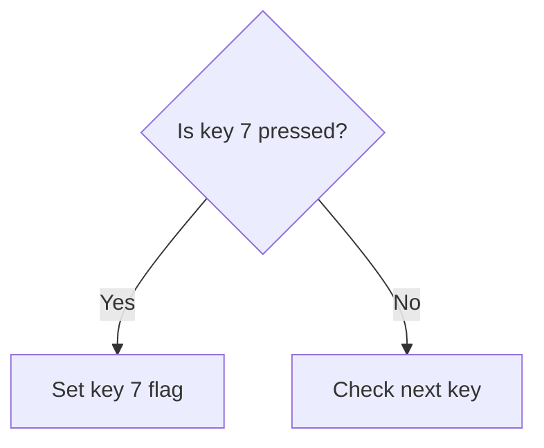

The exact instructions belong in the source code. The flowchart preserves the algorithmic decision.

The same principle applies to comments. If the reader can see *how* the code performs an operation, the comment should usually explain *why that operation is being done* or *what role that section plays*.

---

# 3. Read and draw a basic chart

Learn the visual language, establish a readable direction, and follow a small chart from entry to exit.

## 3.1 The symbols you need most often

These conventional symbols describe program behavior. Use the same meanings with any drawing method. The [standards background](#standards-background) and source documents are collected with the [References](#references).

| Symbol | Name | Use it for | RCET example |
| --- | --- | --- | --- |
| Rounded rectangle / stadium | Terminator | Entry or exit from a chart | Start, Return, End |
| Rectangle | Process | A meaningful algorithmic operation | Increment count, configure a port, set a key flag |
| Diamond | Decision | A condition that selects between paths | Key 7 pressed? Counter zero? |
| Parallelogram | Input / Output | Information entering or leaving the algorithm | Read switches, display value |
| Rectangle with double vertical edges | Predefined process / subprocess | A separately defined routine or algorithm | `LongDelay`, `ScanKeypad`, `DeterminePriority` |
| Small circle | On-page connector | Continue flow elsewhere on the same chart | Connector A |
| Off-page connector | Off-page reference | Continue the same chart on another physical page | Continue at connector B on p. 44 |
| Arrow | Flowline | The next possible execution path | Process → decision |

### 3.1.1 Visual symbol example

[Open this diagram in Mermaid Live Editor](https://mermaid.live/edit#pako:eNo1j0EPgjAMhf8K6QkSEu5cjIoHEg1E9IQc5lZkCWxkdDGG8N8dDntqv7zX9s3AtUBIoe31m3fMUHC-PlTg6hbWFa0gCU5KNJGnZV0azXGaGj9nc4ZcTlKr3eJJXtRJrka7GgtLrkk2bXU_1M6OAlupUASj3-R0k30abcnRZtMew3AfuZsQw4BmYFJAOgN1OKzfug3M9gRLDMySrj6KQ0rGYgx2FIwwk-xl2PCHKCRpc_FRf4mXL2TpUik)

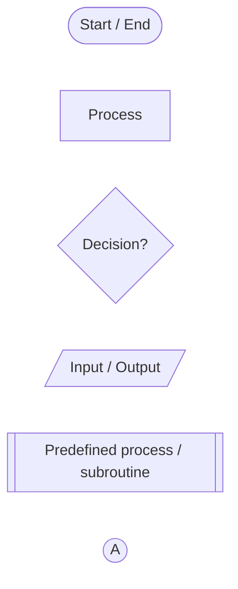

### 3.1.2 Use a small, consistent symbol set

Flowchart standards and drawing programs contain many more specialized symbols. Use another symbol only when its meaning adds something useful.

**A diagram with six familiar shapes used consistently is usually easier to read than one that uses fifteen shapes the reader must decode.**

## 3.2 RCET layout conventions

The following rules are partly general practice and partly **RCET conventions** chosen so student diagrams have a consistent visual grammar. The historical ANSI/FIPS reference describes left-to-right and top-to-bottom as normal directions of flow. RCET prefers top-to-bottom for most program flowcharts because it usually leaves useful horizontal space for branches and loop-back paths.

### 3.2.1 Top-to-bottom is preferred

Use a top-to-bottom primary flow when it fits the algorithm.

A left-to-right chart is completely acceptable when it makes the algorithm easier to read.

The important requirement is not that every chart be vertical. The requirement is that the **primary direction be obvious and consistent**.

### 3.2.2 Keep forward execution in the primary direction

For a top-to-bottom chart:

- normal forward execution generally moves downward;
- alternate branches may move sideways;
- loop-back paths may move upward;
- avoid sending ordinary forward execution upward merely because there happened to be empty space there.

For a left-to-right chart, apply the same idea horizontally.

### 3.2.3 Keep lines clean

First trace the execution order. If the flow itself is hard to follow, review the code structure using [section 6.4.4](#644-when-tangled-flow-calls-for-refactoring) before adding more routing devices to the drawing.

Prefer:

1. a short direct flowline;
2. a labeled on-page connector;
3. an off-page continuation if it is truly one chart that simply ran out of paper;
4. decomposition into child flowcharts when the complexity itself is the problem.

Avoid line crossings when practical.

### 3.2.4 Use consistent alignment and spacing

Blocks that serve similar roles should look like they belong together. Keep:

- box sizes reasonably consistent;
- rows/columns aligned;
- branch labels near their arrows;
- connector styles consistent;
- enough white space that arrows can be followed without hunting.

### 3.2.5 Give the chart enough page space

Students should expect some program flowcharts to occupy **an entire lab-book page or two pages**.

A flowchart printed only slightly larger than a postage stamp is not acceptable documentation simply because every block technically appears on the page.

The correct response to increasing complexity is usually one or more of:

- give the chart more page space;
- split the same chart across pages with off-page connectors;
- decompose meaningful routines into separate child flowcharts.

## 3.3 Read and trace a complete small chart

This small example contains an entry, an operation, a decision, repetition, and an exit. Read the shapes and arrows first. The editable source is included with every diagram; authoring syntax is explained in [section 9.2](#92-mermaid).

[Open this diagram in Mermaid Live Editor](https://mermaid.live/edit#pako:eNpNz00OgjAQBeCrNLOSBC7AQmNBd7rBjQEWDR1oE9qaMo0xwN3lJya-5fdmMW-ExkmEFNrevRslPLEHryxbcj6UBS1QRyxJjoyXuWODM0hK267eb_hWZeNVWz0olKd592z16e4mxv_hicPE8kN5sbKOKgsxGPRGaAnpCKTQrJ9IbEXoCeYYRCBXfGwDKfmAMYSXFIS5Fp0X5ocoNTl_22dsa-YvwVlEPQ)

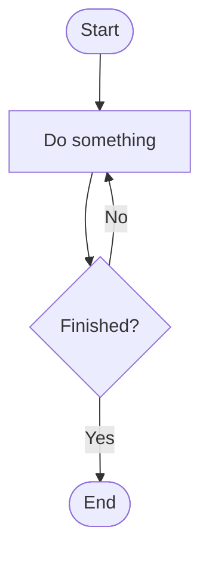

**Trace it now:** start at `Start`, perform `Do something`, and answer `Finished?`. Follow `No` once to see the repeated work, then follow `Yes` to `End`. Every outcome has an explicit destination. This example teaches the pattern; replace the generic operation and question with the behavior required by your assignment.

---

# 4. Sequence, decisions, and loops

A sequence follows one operation with the next. A decision selects a path. A loop repeats work. Learn those patterns here, then trace the counter, delay, and priority examples.

## 4.1 Decisions select a path

A decision contains a question or condition.

Prefer:

```text
Is key 7 pressed?
```

instead of:

```text
Check key 7
```

Label every outgoing result:

- `Yes` / `No`
- `True` / `False`
- or another pair that is equally unambiguous.

RCET does **not** require that Yes always go in one physical direction. Arrange the chart so the continuing path is visually natural and both branches are unmistakable.

Example:

[Open this diagram in Mermaid Live Editor](https://mermaid.live/edit#pako:eNpNjr0OgkAQhF9lszW8AIUmQqsFWmjQ4sItcgncXta9GAXeXfAnccpvJjMzYM2WMMOm43vdGlE4bM4eZhVDztErCTxJeD19KaTpatzxCGVVUiCj0DGHy797otsIxypnr85HgiB8FdPPGUywJ-mNs5gNqC31y7alxsROcUrQROX9w9eYqURKMAZrlApnloIfJOuUZfs5_v4_vQASj0Oz)

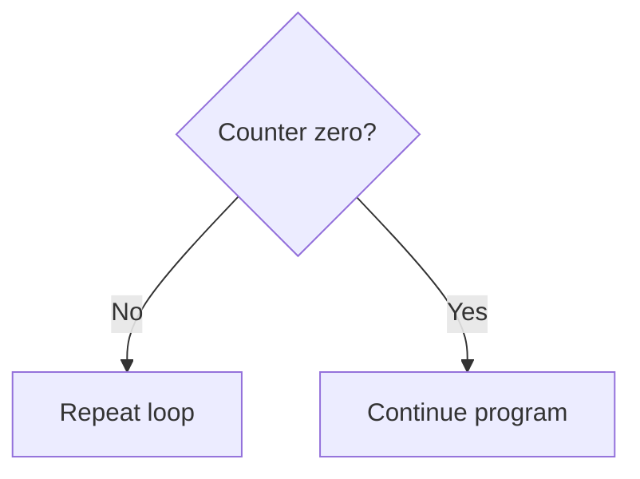

Every decision branch should be understandable without guessing.

## 4.2 Loops should look like loops

A useful loop shows:

- what work repeats;
- what state changes;
- what decision controls repetition;
- where execution goes when repetition ends.

[Open this diagram in Mermaid Live Editor](https://mermaid.live/edit#pako:eNpNj81qw0AMhF9F6Oy8gA8NTnxNCEl9KG4Owis3C96VUbSEYvvd6x8CndPwCQ0zAzbiGHNsO3k1D1KDz8N3hFlFfWFtRQNIZPDGSuYl3mG3-4CqrnpHxtCJ9PC02d63t2q9l8OVeybbTxstFzp-8XOE4j85ywjH-ijRfEwMvcqPUpijMMPAGsg7zAe0B4elpeOWUmc4ZUjJ5PYbG8xNE2eY1j6lpyXgDdl5Ez1tE9el0x90TFA6)

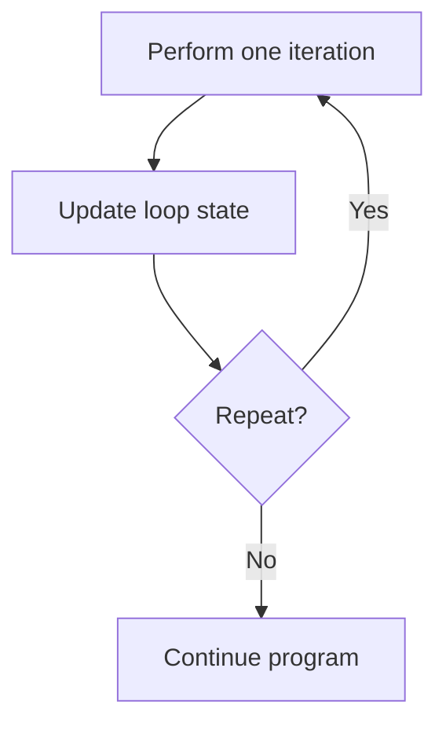

The backward/upward path is acceptable because it carries specific meaning: **repeat**.

Avoid backward arrows for ordinary forward execution.

For complete worked loops, see the [short delay (section 4.4)](#44-example-rcet3375-short-delay-loop) and [nested delay (section 6.2)](#62-nested-loops-and-increasing-complexity).

## 4.3 Example: RCET3375 PORTB counter

In the early counter lab, PORTB configuration is part of the lesson, so it belongs in the chart at useful detail.

[Open this diagram in Mermaid Live Editor](https://mermaid.live/edit#pako:eJxNkD9rwzAQxb_KoakFB3sreCjE7eIhcbENHZwMQjo7Alsy51P_hXz3CtkpveGGu997D95VKKdR5KIf3ae6SGJoi5OFMM1DV-OCDCk0HB7nR9jtnmHfvTjbm8ETwltVtwXMxi7QOwJtBsNyBDcjSTbOnlenfRS2_4R1keVPIBdwnmfPywa2ESy70ho2cjQ_94gVgw85egR2kH1l2aYpo6bq0ncyjKA8EVoG5XzYAY0G6QZXET6GAEU4_XHb97hanaxIxIQ0SaNFfhV8CWioSGMv_cjilgjp2TXfVomcyWMi_Kwl46uRA8npfkRt2NFh7TfWfPsFMXF2Xg)

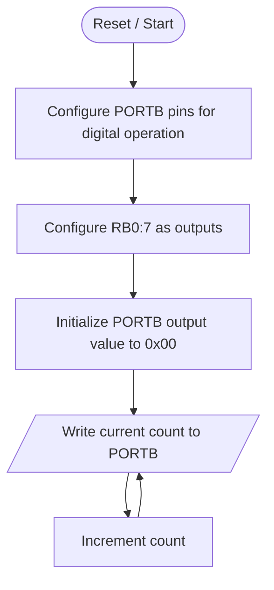

The chart has an obvious downward setup sequence followed by an obvious loop.

**A chart that scatters those blocks around the page may still be logically correct, but it makes the reader spend effort finding the next step instead of understanding the program.**

## 4.4 Example: RCET3375 short delay loop

Lab 03 begins with a software delay based on an 8-bit counter.

A useful flowchart is:

[Open this diagram in Mermaid Live Editor](https://mermaid.live/edit#pako:eNpVkMEKwjAMhl8l5KQwX2AHBam36WVedO4Q2ugGays1RXTbuzs3Bc3x4_sT8reovWFM8dz4u64oCOzXJwfD5LNi44QDGG7oUc5hsVhCVmSezIRA-zgK91oq2JVTLBs9VSjWgS07-Zc_lhqtY6v-Fj05-FU_Gce30e18B-oXHPjWwWZWfIP22rBwOT85TNBysFQbTFuUajg-_GX4TLER7BOkKD5_OI2phMgJxqshYVXTJZD9Qja1-LCdShm76V-3EV-g)

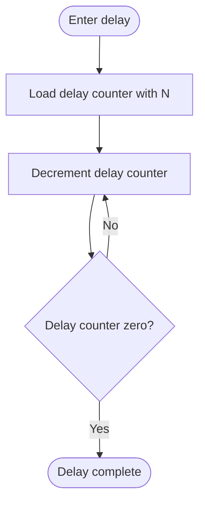

The flowchart shows the algorithm.

The timing analysis belongs beside it:

- how many instruction cycles the setup uses;
- how many cycles each repeated path consumes;
- how `DECFSZ` changes timing on the final pass;
- how the total delay is calculated.

Those facts are important, but giving each timing detail its own flowchart block would make the algorithm harder to see.

## 4.5 Example: DIP-switch priority selection

RCET3375 Lab 02 Part 3 requires:

- eight switch inputs;
- switch 7 highest priority;
- switch 0 lowest priority;
- display the largest active switch number;
- display `$` if no switch is active;
- repeat continuously.

Students sometimes try to compress this algorithm into a tiny number of boxes so the diagram will print small. That hides the exact decisions that define the priority algorithm.

### 4.5.1 FC-1 Main program

Begin with the repeating job: read the switches, process that saved reading, and read again. The named step `FC-2 Select and display priority` refers to the detailed child chart in [section 4.5.2](#452-fc-2-select-and-display-priority). Follow that chart from entry to return, then resume along the arrow after the named step in FC-1.

[Open this diagram in Mermaid Live Editor](https://mermaid.live/edit#pako:eJw1j0GLg0AMhf9KyKkLSmGPHhZal14r2tvUQ5iJdUBnZCazRUr_e612c8vLe98jD9TeMBbYDf6uewoCl-PVwTLNTjWyCO0X5PkPHFTpXWdvKTBU5_pyBOumJEDOrHsJxsZpoBl8kuXQbpTDGq7VvmYyqznSH0O8W9E9RCHhuP9469VbKXUq829oeGC98f_JU7A-WJnbT6Da4FeHGY4cRrIGiwdKz-P7J8MdpUHwmSEl8c3sNBYSEmeYJrM0_1q6BRo38fkCHbRXdw)

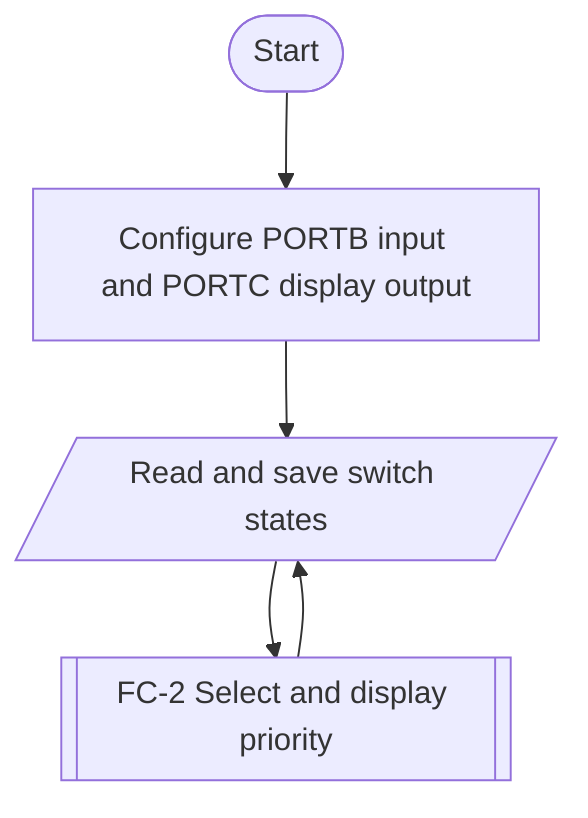

FC-2 selects the highest active switch, displays the result, clears the saved switch states, and returns. FC-1 then reads fresh switch states. The display operation belongs to FC-2 in this design, so each pass displays its result once.

### 4.5.2 FC-2 Select and display priority

Follow the saved switch states from highest priority to lowest. Every Yes branch displays its switch number and joins the cleanup path. If all switches are inactive, display `$`.

[Open this diagram in Mermaid Live Editor](https://mermaid.live/edit#pako:eJxt1Mtum0AUBuBXGR11kUjYGeaGQVUqOcmii3phd9MYL6YwtpEwWMOQ1LX97sWQZrixQPPDOR8gceYMUR4rCGCb5u_RXmqDfs7DDFXHy936JTNKo_fE7FEh31SMimodVcFIo4rNPZpMHtHcO4fwvfi49_W3fnj06rOMTPKmvoVwbcC5d6u__FLFBa28dQjPSXFM5alpCWHTKVvkFzQXA1qM06JFix4tLC0szQc0H6d5i-Y9mluaW5oNaDZOsxbNejSzNLM0HdB0nKYtmvZoamlqaTKgyThNWjTp0cTSxNLugHbHabdFuz3atbRraTyg8TiNWzTu0djS-JNeLXpVXz6rVvUvipZVwVOqpG6moy7qTIhtEE3DR-KdxDqJdhLpJLeTcCct2mnZTObdeqlMqTNkchTJNFV6cx9m4MBOJzEERpfKgYPSB3mLcL41h2D26qBCCKplrLayTE0IYXat2o4ye83zw_9OnZe7PQRbmRZVKo9x9c3PidxpaUtUFiv9lJeZgYDNagKCM_yBYEI5m3Lm-hgLyjzBhQOn6jLBZCoExR4W3sxzsc-uDvytH0unmBDOfOzPvJngnu-AihOT6x_NJlbvZQ7I0uSrUxY1L3H9B1W2dCc)

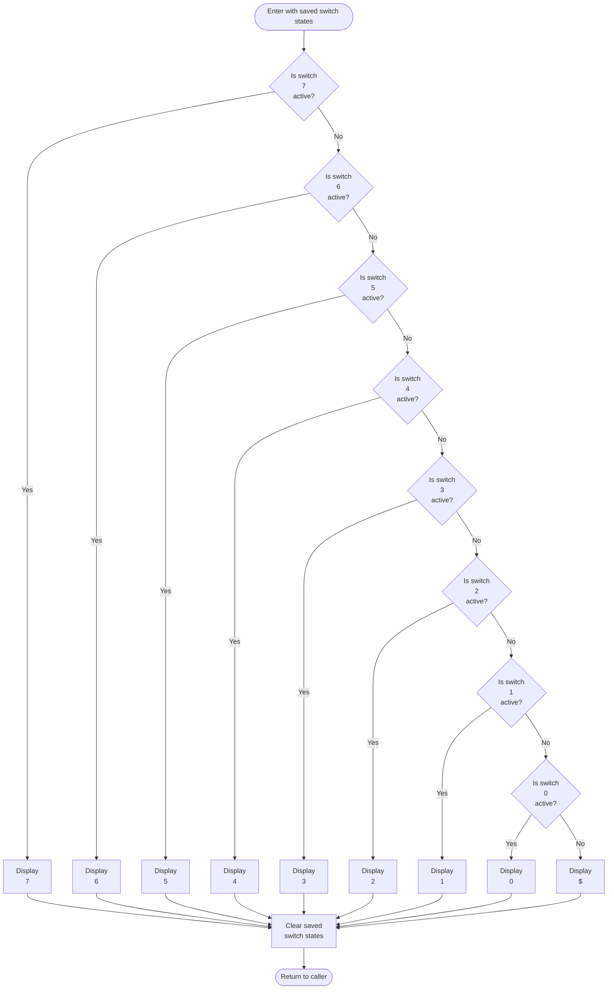

This chart is tall because all eight priority decisions are visible. It may deserve an entire lab-book page. The shape makes the priority rule obvious: test from highest to lowest and stop at the first active switch.

The complete flowchart set for this design is:

```text
FC-1  Main Program
FC-2  Select and Display Priority
```

**Trace the pair:** if switches 7 and 2 are active, FC-1 saves that reading and enters FC-2. The switch-7 Yes path displays `7`, clears the saved states, and returns to FC-1 for the next reading. If no switch is active, follow every No path to `$`, then use the same cleanup and return path. [Section 5](#5-trace-and-improve-the-design) develops this tracing method further.

### 4.5.3 Alternative: return the selected value

A different division of responsibility is also possible: a selection routine returns a value, and the main program displays it. The alternate charts use `FC-A1` and `FC-A2` to distinguish them from the complete FC-1/FC-2 pair in sections [4.5.1](#451-fc-1-main-program) and [4.5.2](#452-fc-2-select-and-display-priority).

The following overview is **FC-A1 Main Program**:

[Open this diagram in Mermaid Live Editor](https://mermaid.live/edit#pako:eJw1jzGPgzAMhf-KlelOAiHdyFCJgm4tgm4pg0VMiQQJSpxWqOp_Lxc4b37-_J79Er1VJHIxTPbZj-gYruebga3aL9nyJnTfkKYnKGRpzaDvwRHUl-Z6Bm2WwIBGxb4Epf0y4Qo28DbodpciLjcyawhVhD0-CPxTcz-CZ2Ty2cE2ka2l_C3T4gdamqhnWJy2TvMKD5wCdQdbR7aSWXWk-kiT2rF_y2qPvxmRiJncjFqJ_CV4pPnva0UDhonFOxEY2Lar6UXOLlAiwqK22yqNd4fzLr4_BVFhyA)

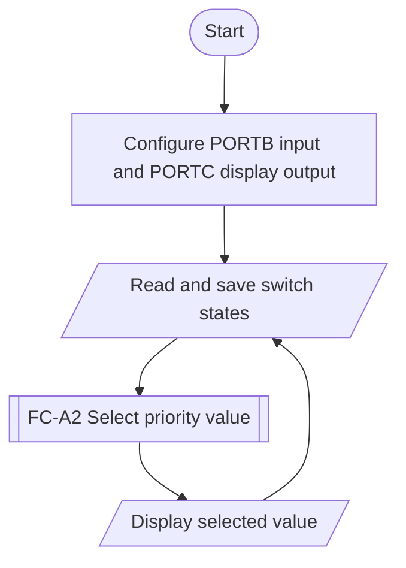

To create **FC-A2 Select Priority Value**, adapt the detailed decision chart: replace each `Display` operation with setting the selected value to that switch number or `$`. Keep the cleanup of saved switch states, then return the selected value to FC-A1. FC-A1 displays that value once and reads the next inputs. A complete submission using this alternative must include the adapted FC-A2 chart.

Both divisions can meet the same requirement. Choose one, name the charts consistently, and make the caller and child agree about who selects, displays, clears stored state, and returns. The subroutine and decomposition lessons in [section 6](#6-choose-detail-and-manage-complexity) explain these relationships in more detail.

---

# 5. Trace and improve the design

Check the behavior of each chart as you build it. Begin with the small example in [section 3.3](#33-read-and-trace-a-complete-small-chart), then use representative inputs to test the more detailed paths.

## 5.1 Manually trace the chart

A flowchart can be tested before the program is built.

For the priority-switch algorithm, try representative inputs:

```text
PORTB = 00000000  → expected $
PORTB = 00000100  → expected 2
PORTB = 10000100  → expected 7
PORTB = 01010101  → expected 6
```

Start at the chart entry and follow the arrows exactly.

Ask:

- Does every decision have a valid path for every outcome?
- Are all decision paths labeled?
- Does every loop return to the correct place?
- Can execution become trapped unintentionally?
- Does every required output have a reachable path?
- Does priority match the requirement?
- Does a subroutine return to the caller rather than a hard-coded destination?
- Does an ISR exit through the correct interrupt-return mechanism?

Tracing catches design errors before hardware and assembly-language details are added to the problem.

## 5.2 Use confusion as a design clue

When you cannot explain the next step, identify whether the problem is the drawing, the level of detail, or the execution order in the source. A large chart may need more page space. Several meaningful routines may need separate charts. Tangled branches may require code refactoring.

Work out the chart while coding so these problems surface early. Preserve the required behavior, then trace and test the revised design. [Section 6](#6-choose-detail-and-manage-complexity) develops the detail and decomposition choices; [section 6.4.4](#644-when-tangled-flow-calls-for-refactoring) gives the full refactoring workflow.

---

# 6. Choose detail and manage complexity

Keep the decisions needed to explain the program while organizing its detail into readable, meaningful units. Apply these techniques as the algorithm grows.

## 6.1 Choosing the right level of detail

This is one of the most important flowchart skills.

A flowchart should use **natural language that describes the algorithm**, not English translations of individual source instructions.

The correct level of detail also depends on **what the assignment is trying to teach**.

### 6.1.1 Too vague

[Open this diagram in Mermaid Live Editor](https://mermaid.live/edit#pako:eNo1j0EKgzAQRa8SZtWCXsBFwdJtQUhdRRchGWvAJJJMKCLevTbav3yPGf5fQXmNUMEw-Y8aZSD2uneO7eEXwWkH_ZWV5Y3VgiOluT9knVkjmuAVxsiMmxPFUzZZtqKdtSRkcYmE9nTtcdg5KMBisNJoqFagEe2vhsZBpolgK0Am8nxxCioKCQtI-dvDyHeQ9g9RG_LheWzIU7YvRq1D4w)

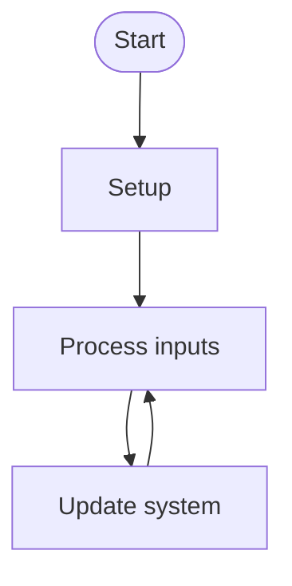

This hides the important work. `Setup` is especially weak when setup is the new technical skill students are supposed to learn.

### 6.1.2 Early labs should expose the setup being learned

In an early PORTB lab, several configuration operations may deserve separate process blocks because the register configuration is part of the learning objective.

[Open this diagram in Mermaid Live Editor](https://mermaid.live/edit#pako:eJxNkEFrg0AQhf_KsKcWDPZW8FCI7cVDYlGhB5PDsDuaAd2VdbalDfnvXdSUzmEO8773Bt5VaWdIZaob3Je-oBdo8pOFOPVDW9FMAinUEoXzI-x2L7BvX53tuA-e4L2smhwmtjN0zoPhngUHcBN5FHb2vCbtF2Pzz1jlT9kz4AwuyBRk3sBmAYu2sCyMA__cX6wYfOIQaGOLhS3b9MOzEOjgPVkB7ULc4lZjusHlAh9jsPY0_nGbelyjTlYlaiQ_IhuVXZVcIhqrMdRhGETdEoVBXP1ttcrEB0pUmAwKvTH2Hsf7kQyL84e116Xe2y_Pq3Qz)

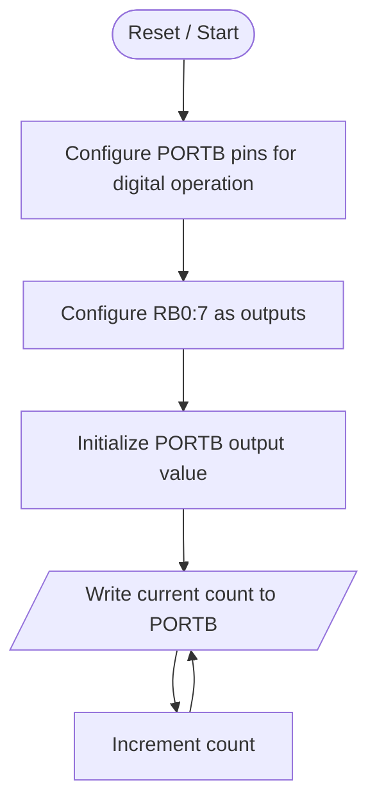

Depending on the assignment, naming the relevant SFR may also be appropriate because the student is learning what that register does:

```text
Configure ANSELH so the required PORTB pins operate digitally
Configure TRISB so RB0:7 are outputs
Initialize PORTB output value
```

That is not the same as making a separate block for every assembly instruction.

### 6.1.3 Later labs can summarize established setup

By the keypad lab, students should already know the basic configuration process. The flowchart can move up a level:

[Open this diagram in Mermaid Live Editor](https://mermaid.live/edit#pako:eNpNkMsKwkAMRX8lZF1BUBBmITh160bdVRehk7aD7UyZZpAi_rt9glnm3Hvz-GDuDaPCovbvvKIgcNcPB0OdstS7wpYxMFz1Vu2AOnhx35IB69ooHZAzA9qrw4i6nBz4KCN5LhGw2RxB_wel21m9CKHwAaRiMLZra-oXo56Maaa5tG4dOg4YOCbYcGjIGlQfHLzNuL_hgmIt-E2Qovhb73JUEiInGFtDwmdLZaBmbbKx4sNlPn76wfcHBvxZGA)

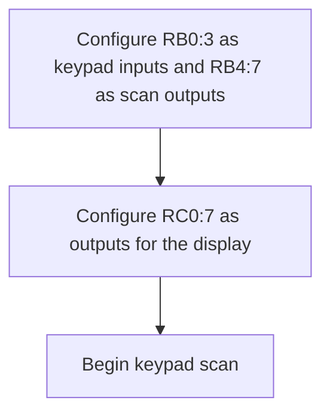

The setup is still specific enough to communicate the intended hardware configuration without re-teaching every SFR operation in the main flowchart.

There is no single correct number of blocks for “initialize hardware.” Choose the detail according to the learning objective: expose the setup being learned, and summarize established configuration at the level needed to explain the algorithm.

### 6.1.4 Decisions should not be hidden merely to save space

If the program makes eight separate priority decisions, those decisions should appear somewhere in the complete flowchart set.

Do not replace:

```text
Is key 7 pressed?
Is key 6 pressed?
Is key 5 pressed?
...
```

with:

```text
Check keys
```

just to make the chart shorter.

A group of decisions may be moved into a **child flowchart**, but the child chart should still contain the actual decisions.

### 6.1.5 RCET rule of thumb

> **One block should represent one meaningful algorithmic operation at the level currently being described. Every control-flow decision at that level should remain visible.**

### 6.1.6 A starting pattern to expand

This is a partial starting pattern. Complete the path after `Update Outputs` to match your program: return to `Read inputs` for continuous monitoring, or show the next step or exit explicitly.

[Open this diagram in Mermaid Live Editor](https://mermaid.live/edit#pako:eJxNkU1vwjAMhv9K5NMmFSgN_cphkwYXDtuksh1Y20NEDFSjCQuJGJT-96VlTPPJ9vs-dhQ3sFICgcF6p46rLdeGvD0VkrhY3OUL4xrlPRkMHsg8n8vKVHxXnZFo_LKVRkEcIY5cY3ll5r01y0cZckEqubfmMPrVsl6bNVMlhRuk5GNbyKs066TLEg8Xsszf94IbJK_WdHT53_GiLiTrIPBgoysBzGiLHtSoa96V0HT2AswWayyAuVRw_VlAIVvH7Ln8UKq-YVrZzRbYmu8OrrL93lnFN5rXf12NUqCeKisNsEnazwDWwDewsR8PA9_3aRClNImSOPDgBIzSIfWjMKExnaQ0pHHrwbnf6g-TKAhTn46DNIzjiMYecGvU4iRXtzeh-xuln69H6W_T_gBi9oHj)

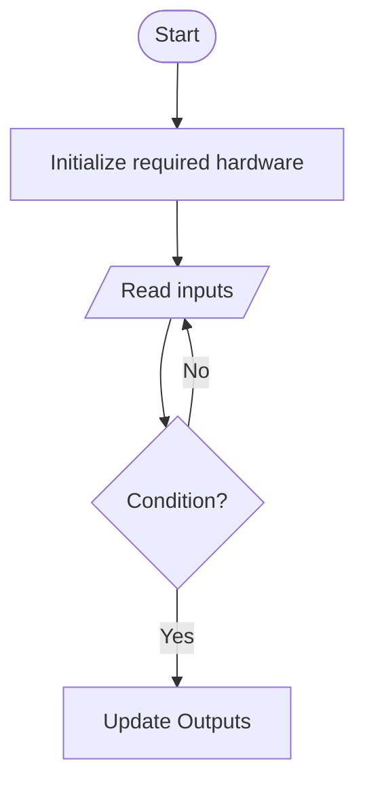

Replace the generic labels with natural-language algorithm steps. Expand initialization to the detail required by the assignment; the guide's early-lab setup example ([section 6.1.2](#612-early-labs-should-expose-the-setup-being-learned)) shows why one generic box may be insufficient. See flowcharting the algorithm ([section 2.4](#24-flowchart-the-algorithm-not-the-syntax)) for label wording.

## 6.2 Nested loops and increasing complexity

Lab 03 Part 3 extends the single counter into a nested inline delay.

[Open this diagram in Mermaid Live Editor](https://mermaid.live/edit#pako:eNptkcFqwzAMhl_F6NRC-gI5rFCygyGrD-1lSXMwttoaYrt4MqNL8-7zYsYSVl0Evz7x_0gDKK8RSjj3_lNdZSB23J0cS3VYtTu8GMc09vLerdlm88Jq0dZeauYjYWDKR5d6lxdqkRGeEePcf4RPSMXbClVAi46eclXmeDPw-ZR9YfDbMTO8-WEee_9I-EJ6x4-kiZnHs7hVjiuaQcynCw_x51HzhTR5vK6SRzpO2rW3Hgm79clBARaDlUZDOQBdU4J0X41nGXuCsQAZyR_uTkFJIWIB8aYlYWXkJUj7K6I25MNbfs70o_EbUpaKqQ)

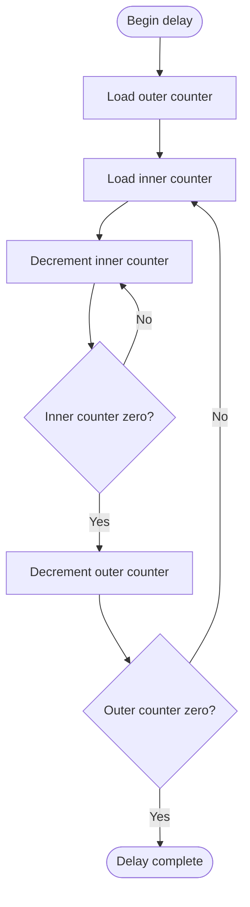

Both decisions matter and both should remain visible.

This chart is still small enough to stand alone. If it becomes one component of a larger program, the main chart could normally use a predefined-process block such as `LongDelay` rather than embedding this entire nested-loop structure repeatedly.

## 6.3 Subroutines and hierarchical flowcharts

In the caller, use the predefined-process symbol for a separately documented routine. Its outgoing arrow shows what happens after the routine returns. The child chart begins with entry to the routine and ends with `Return to caller`; the charts in sections [6.3.1](#631-fc-1-main-program), [6.3.2](#632-fc-2-longdelay), and [6.3.3](#633-fc-3-shortdelay) supply the complete routine details.

A `CALL`/`RETURN` subroutine is especially well suited to a separate child flowchart.

On the PIC16F883, `CALL` transfers control while saving a return address on the hardware stack. `RETURN` uses that saved address so execution resumes after the original call.

### 6.3.1 FC-1 Main Program

[Open this diagram in Mermaid Live Editor](https://mermaid.live/edit#pako:eNp1kD0LwkAMhv_KkUmhpVpw6eCgR6GgU508O4ReqgftnZwpouJ_t_YDJzPmfR5C3heUThMkUNXuXl7QszhsTlZ0k89Uzt2imIswXItMZdawwdo8SXSgvqOnYkCznkhVJM3tWuNDrKIxSftELpVKt2Esds6eJXVEMeZy2QPHn7qY1OOgxn_VeLh6shBAQ75BoyF5AV-o-X6kqcK2ZngHgC27_GFLSNi3FEB71cgkDZ49NtOStGHn90MdfSvvD_PtV5k)

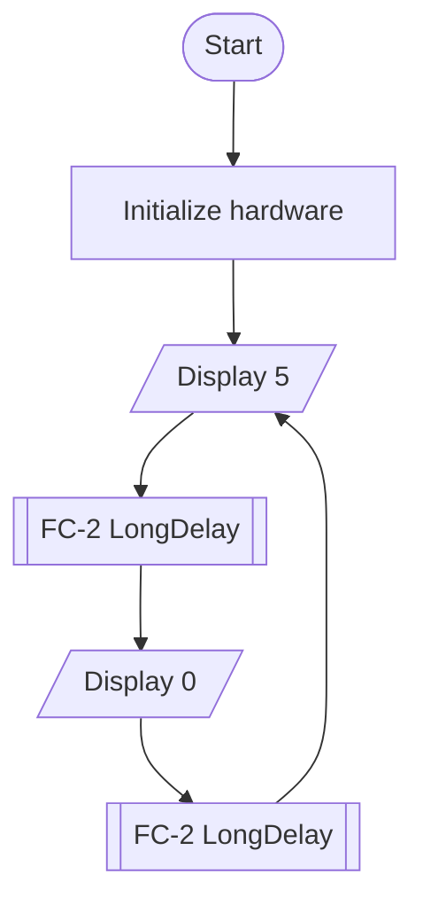

### 6.3.2 FC-2 LongDelay

[Open this diagram in Mermaid Live Editor](https://mermaid.live/edit#pako:eNp1kE9LxDAQxb_KMKddaE_eelDQrKcq7MaLZPcQktltIc1InCBr2-9u_ygI4hzf-73H8Hp07AkrPAf-cI1NAi_3xwjT7TZmF4US1BwvioK9nrZQlrdQm5qthzDJpZ91cJxn8rQG64XSxjw-lDegG06yxr99vfjKKHKJOoryf5Va0H1f_wHgkxLfjSu2n7HhmQfQv4VXeh_gsDEHkpwiCIOzIUzl22PEAjtKnW09Vj1KMz0yreDpbHMQHAu0WVhfo8NKUqYC85u3Qqq1l2S7H5F8K5ye1gmXJccvoH1uPg)

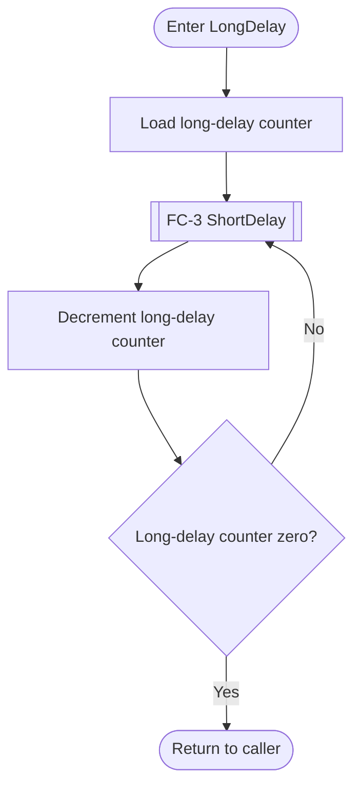

### 6.3.3 FC-3 ShortDelay

[Open this diagram in Mermaid Live Editor](https://mermaid.live/edit#pako:eNp9kE1qw0AMRq8itErAvoAXLZTJzi0k7qY4WYgZpTbYo6JoKKntu9c_FAqFavn0JKRvQC-BscBrJ5--ITV4fTpHmOuwqw_RWKFqRM1xR_fLHvL8Acq6FApwW3gelgZ4SYt72UbLVXO1Y6_cc7R_XLe6x6H6a8AXqzxOm3dcvPFFRnC_wRvfRjjt6hNb0ggm4Knr5u37c8QMe9ae2oDFgNbMp8yfBr5S6gynDCmZVPfosTBNnGH6CGTsWnpX6n8gh9ZEn7eY1rSmb8RpZu8)

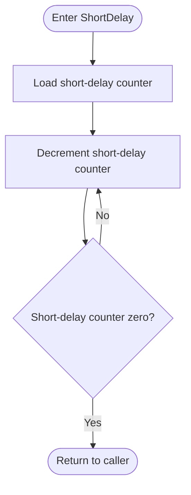

Students should resist the temptation to merge FC-2 and FC-3 back into every location in FC-1 that calls them. The whole point of the predefined-process symbol is to show that a named piece of behavior is defined elsewhere.

A placeholder such as `Perform delay algorithm` may help with an early sketch, but a complete child chart must replace it with the actual loop and decision steps. Continue the caller’s path after the call as the program requires.

## 6.4 CALL/RETURN is not the same as GOTO

This distinction matters both in source code and in flowcharts.

### 6.4.1 `CALL` / `RETURN`

A subroutine call has an implicit relationship with its caller:

1. `CALL` transfers control to the subroutine.
2. The processor preserves the return address.
3. The subroutine performs its work.
4. `RETURN` resumes execution after the instruction that called it.

The subroutine can therefore be called from different locations and return to the correct caller.

In the caller's flowchart, use a predefined-process symbol:

[Open this diagram in Mermaid Live Editor](https://mermaid.live/edit#pako:eNo1js0KwjAQhF8l7Ll9gR4Ea66eFDy0PWyTjQbzI-sGKaXvbm1xjh_zMTODyZagARfyxzyQRV3bPqk1x-6W-alGcplJGQxhUHV9ULrrNAWc1LuMnIv4RMOwK3ortN0ppxUXUuiEeHf7BBVE4ojeQjODPCj-hi05LEFgqQCL5MuUDDTChSooL4tC2uOdMf4hWS-Zz_vr7fzyBUZJQoU)

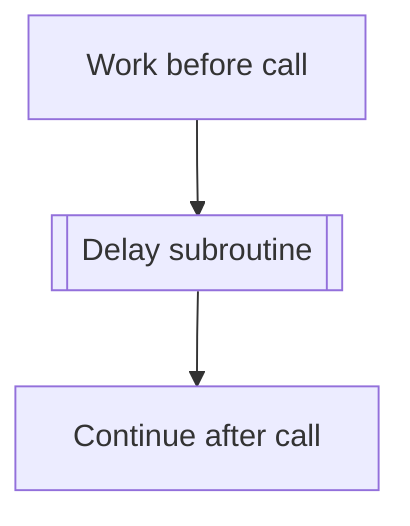

The subroutine has its own chart ending in **Return to caller**.

### 6.4.2 `GOTO`

`GOTO` is an unconditional branch to a specified program location. It does **not** save a return address.

If code uses:

```text
GOTO HandleError
```

and the `HandleError` code later uses:

```text
GOTO MainLoop
```

then the destination after `HandleError` is explicitly built into the program flow. That is different from returning to whichever location called the code.

[Open this diagram in Mermaid Live Editor](https://mermaid.live/edit#pako:eNpNj8sKg0AMRX9lyFp_wEWhL-qi4qLurIt0JlbpPCTMUIr67_WBtFkll5PLvT1IpwgSqLV7ywbZi-Jwt2KafXkMzGS9mJFKxPFuuORFLlK0StOZ2fEg0vLvXEjx0E6-qtUk_b1l2Nqrc90gsnLbJwoiMMQGWwVJD74hM8dRVGPQHsYIMHh3-1gJiedAEYROoadTi09Gs4mkWu84W7sslcYvjZhKbA)

```mermaid
flowchart TB
    A[Current code] -->|GOTO HandleError| H[HandleError code block]
    H -->|GOTO MainLoop| M[MainLoop]
```

For RCET PIC assembly terminology:

- **subroutine** means a routine entered through a call mechanism and exited through the matching return mechanism;
- code reached by `GOTO` is best described as a **branch target**, **labeled code block**, or **shared code path**, depending on its role;
- do not call a `GOTO` target a reusable subroutine merely because it contains several useful instructions.

### 6.4.3 Visual comparison

[Open this diagram in Mermaid Live Editor](https://mermaid.live/edit#pako:eNpdUcFqwzAM_RXhc8tYesthMNLRHdIVuu7k9aDYyhLqWEWzKaXtv89J6Bamg0Divef3rIsybEnlqnZ8Mg1KgHL76SHVd6y-BI8NFM9lqfsGD7B92X1s3_Yjoq_iURfoHEkOJ5YDVFSzEJi028N8_gRFpvWSHJ57QeEYWk_7qUA2wha_OoZ9AkUCrAPJKDXiydt_3lab3Ub3LXmLPjFtG1r26KAS9KaZPLRKTqMI-QB95sHddaC-oreOXkRYrrDK9GQeoFA5NoepVPZHXmPrS-ZjYi70fZj6VTPVkXTYWpVfVGio6__bUo3RBXWbKYyB38_eqDxIpJmKR4uBli2miN19SSkYy3o81nCz2w9vjo67)

```mermaid
flowchart LR
    subgraph CALL[CALL / RETURN]
        C1[Caller: work before call] --> C2[[Delay subroutine]]
        C2 --> C3[Caller: continue after call]
    end
    subgraph GOTO[GOTO / unconditional branch]
        G1[Current code] -->|GOTO HandleError| G2[HandleError code block]
        G2 -->|GOTO MainLoop| G3[MainLoop]
    end
```

This distinction will become increasingly important as programs contain multiple callers, nested subroutines, and interrupts.

### 6.4.4 When tangled flow calls for refactoring

**A flowchart that is too complex or difficult to trace may be revealing a problem in the code.** If making the drawing appear orderly requires more `GOTO` labels, connector pairs, or jumps between distant blocks, consider fixing the execution flow itself. Adding labels can name the confusion without resolving it.

Organize source code so execution is easy to follow: a reader should be able to identify the next step, each alternative, each loop, and where a routine returns. Do not arrange executable statements into visual chunks, collect similar actions in distant blocks, or scatter the sequence merely to reduce register-bank switching. Those arrangements can force execution to jump around just to perform a straightforward task. Keep necessary bank selection with the operations that require it; reducing bank switches should not dictate a confusing program structure.

For example, suppose a program repeatedly reads inputs, selects a result, and updates a display. Putting all reads in one visual region and all writes in another does not explain that sequence if execution must bounce between them. Arrange the main path as **read → select → display → repeat**. If selection is a meaningful separate algorithm, document its full detail in a child chart and implement a callable routine when that fits the design.

When several places need the same operation and each should continue afterward, a `CALL`/`RETURN` routine can express that relationship clearly. A collection of `GOTO` targets with fixed jumps back to different places makes the continuation harder to follow. Preserve the actual call or branch behavior in the chart while deciding how to improve the source.

PIC assembly also uses explicit branches to implement ordinary decisions and loop repetition. Judge those branches by whether their purpose and destination are clear. A long priority-selection chart may simply need more page space; an automatic renderer may simply need better layout. Complexity is a clue to investigate, not proof that every large chart needs its algorithm changed.

When the flow becomes unclear:

1. Trace a representative input through the current code and chart. Identify the exact point where finding the next step becomes difficult.
2. Review execution order, branch destinations, and routine responsibilities. Put sequential work together and separate meaningful routines where that improves clarity.
3. Refactor the code while preserving the required behavior. Update the pseudocode, chart, and comments as the structure changes; moving boxes alone does not fix tangled code.
4. Trace the revised paths and test the implementation, including alternate outcomes and loop exits. Confirm that the clearer structure still produces the required results.

## 6.5 What “complete flowchart” means in RCET

A complete flowchart does **not** mean one physically continuous drawing containing every operation in the entire program.

For RCET:

> **The complete flowchart is the complete linked set of readable charts needed to describe the program at appropriate levels of detail.**

A program might use:

```text
FC-1   Main Program
FC-2   Initialize Hardware
FC-3   Read Inputs
FC-4   Select Priority Input
FC-5   Update Outputs
FC-6   Delay Routine
FC-I1  Interrupt Service Routine
```

The numbering is documentation structure, not additional program behavior.

The source code and flowchart decomposition will often resemble each other, especially once the source is organized into real methods, functions, subroutines, modules, or other named units.

## 6.6 Continuing a chart versus decomposing a chart

These solve different problems.

### 6.6.1 Off-page connector: the same chart continues

Use an off-page connector when the logic is still one chart but the paper ends.

Conceptually:

```text
Page 1                     Page 2

[Process]                    [A]
    |                         |
    v                         v
   [A]       -------->     [Next process]
```

The two connector references must match.

### 6.6.2 Predefined process: another part or level of the design

Use a predefined-process symbol when a meaningful routine or algorithm is defined separately.

[Open this diagram in Mermaid Live Editor](https://mermaid.live/edit#pako:eNo1Tr0OgjAQfpXLzbA4MpgIxM3Fn6kyXOihl1DalGsMIby7CPEbv_8ZW28ZC-x6_2nfFBXu5XOAFSdzZbIgQ0g6NpDnRyiNOVf5AWpWjk4GhhDFR9GpafZQufkq8wiWlMHKGHqaVhEzdGuGxGIxo77Z_VYtd5R6xSVDSupv09BioTFxhmlrqIVekdyfZCvq42W_vD1fvjTJQP0)

```mermaid
flowchart TB
    A[Read inputs] --> B[[FC-2 Determine priority]]
    B --> C[Update display]
```

`FC-2 Determine Priority` is not merely “the next page.” It is a named unit of behavior.

### 6.6.3 Side-by-side comparison

The left view continues the same chart using matching markers; the right view names a separate unit of behavior. For a printed chart, use the conventional off-page symbol to identify a continuation onto another sheet.

[Open this diagram in Mermaid Live Editor](https://mermaid.live/edit#pako:eNptkk1PwzAMhv9K5BNI27T0g3Y9II0WTmxUfFxIdwit6SLWpEpTwZj238nabSoIn-L49fPakneQqwIhgveN-szXXBty_5hJYqNp30rN6zWJH5bPLFbSCNkiMWskDa-QdOpVr_2lTx2W8hKJMygeIr65uJhfXpLx-JrcsCV-GVJrlWPTDIQoi_-QtEfSP8g5S4-EjhrPO4c_tD49g8_Q5DZ-WKQswVxVtWr61QpsRCkHNgllj8gLImTdmqNP4jB2F48dkqBBXQmJJNVCaWG2q2Gr06td9lIX3Fi4aOoN364GE8EISi0KiIxucQSVxfFDCruDKAM7U4UZRPZZcP2RQSb3tqfm8lWp6tSmVVuuIXrnm8ZmbeeWCG73rM6_2vqhjlUrDUSe3zEg2sEXRGN_ckWnwSx0Qzeg9IrSEWwhmoUTN3Q8h1LqBa4bBPsRfHeudDINvZD6tjzzA88PLY63Rj1tZX6aCQthlF7059Vd2f4HT_64kg)

```mermaid
flowchart LR
    subgraph CONT[Continue the same chart]
        subgraph P2[Page 2]
            CB((A)) --> B[Next process]
        end
        subgraph P1[Page 1]
            A[Process] --> CA((A))
        end

    end
    subgraph DECOMP[Decompose the design]
        D1[Read inputs] --> D2[[FC-2 Determine Priority]]
        D2 --> D3[Update display]
    end
```

### 6.6.4 Decide whether to continue or decompose

Ask why the chart is large.

If the answer is:

> “The logic is straightforward, but I ran out of paper.”

continue it.

If the answer is:

> “This one chart contains several meaningful algorithms and routines.”

decompose it.

## 6.7 Connectors

### 6.7.1 On-page connector

Use an on-page connector when a direct line would be unnecessarily long or cross unrelated parts of a chart.

[Open this diagram in Mermaid Live Editor](https://mermaid.live/edit#pako:eNo9jjELwjAUhP9KeFML6aBjByGpqyDoZjs8kldbaBJJXxAp_e9qit529x3HLWCCJaihn8LTDBhZXHXrxUfqdo7B0DwL1YmqOohmVxSqLDfa7LPJQP-bums9SHAUHY4W6gV4IPfdt9RjmhhWCZg4XF7eQM0xkYT0sMh0HPEe0f1CsiOHeNrO5Y_rG3l_Njk)

```mermaid
flowchart TB
    A[Process A] --> C1((A))
    C2((A)) --> B[Process B]
```

The repeated visible label `A` tells the reader that these two locations are the same broken flowline. Follow the path at the matching label.

### 6.7.2 Off-page connector

Use the conventional off-page-reference symbol in draw.io or a hand-drawn chart when the **same chart** continues on another sheet.

### 6.7.3 Do not overuse connectors

Many connectors are usually a symptom.

Possible causes:

- inconsistent layout;
- a chart that is too dense;
- several algorithms forced onto one page;
- excessive cross-connections;
- missing opportunities for decomposition;
- code whose execution jumps among scattered blocks.

Use connectors for a clearly identified continuation. If adding more connector labels is the only way to make the drawing manageable, inspect the code's execution order and branch structure using [section 6.4.4](#644-when-tangled-flow-calls-for-refactoring). A connector changes how a path is drawn; it does not simplify the underlying program.

---

# 7. Handle asynchronous execution

**Use this section when your program uses interrupts.** Continue to [section 8](#8-document-and-check-the-finished-work) if the assignment has no interrupt behavior to describe.

An interrupt service routine is not an ordinary next step in the main program.

On a mid-range PIC, an enabled interrupt can occur while the main program is executing. The processor saves the return address, transfers control to the interrupt vector, runs the ISR, and `RETFIE` returns to the interrupted execution point.

That means there is no single ordinary main-program box that always leads to the ISR.

Trying to draw arrows from every possible main-flow location into one ISR creates a diagram that is both ugly and misleading.

## 7.1 RCET convention for interrupts

Use separate charts:

```text
FC-1   Main Program
FC-I1  Interrupt Service Routine
```

The main-program chart documents ordinary foreground execution.

The ISR chart documents interrupt handling.

Use a note or callout to explain that the ISR can preempt main execution asynchronously. Keep the main flow and ISR separate, with no direct flow arrow between them.

[Open this diagram in Mermaid Live Editor](https://mermaid.live/edit#pako:eJx1ksFuozAQhl_FmlMqkSg2gQCHSlWqlZDKqgq3hRy84CRog40cO900yrvvgEXL7qo-gO35_n-YYW5QqVpAAvuTequOXBvysi0lwXW2Pw-ad0eS5tvi22aeUpJKI7S2nSG50JemEmSrrGmk2DlJv9LlrEAFEdLoK-GGNB-ii6iM0rsHMp8_kpQWzwIjLconzFlZXf3lRx3OijGnOQoiLug_pZij_GJzElwPzKfp_sQPU9h38GpWbIWxWpK9Vu0nv3twrJD1P63IntLvfS8oyXgjyatWeN9OrPNZkRvs4mgx3A3ZcooFGNsRXplGyanGVZizLwFXXEaLIet_8cwZZOyr-KiflAUeHHRTQ2K0FR60-CN4f4RbD5WADWxFCQlua65_lVDKO2o6Ln8o1Y4yrezhCMmen854sl3NjXhueN-Uj1uN-YTeKCsNJGzps8EFkhv8hoRGwYKtAxb6URzii0YeXBGLFwGly3gdxpTFPj7uHrwPiZeLKKBB7FM_XEfrFV2FHnBrVH6V1fhZom5w0DI32cOA3_8AXafeYw)

```mermaid
flowchart LR
    subgraph ISR[FC-I1 Interrupt Service Routine]
        I0([ISR entry at interrupt vector]) --> I1[Determine interrupt source]
        I1 --> I2[Service the event]
        I2 --> I3[Clear the interrupt flag]
        I3 --> I4([Return from interrupt])
    end
    subgraph MAIN[FC-1 Main Program]
        S([Start])
        S --> S1[Setup action]
        S1 --> S2[Setup action]
        S2 --> M1[Main action]
        M1 --> M2[Main action]
        M2 --> M1
    end
```

The main chart shows its own start, setup, and repeating actions. The ISR has a separate entry and ends with `Return from interrupt`; it resumes the interrupted execution point rather than a fixed next step in the main chart.

This same principle applies to other asynchronous execution mechanisms. Do not force them into a normal sequential-flow diagram if doing so distorts how the system actually works.

---

# 8. Document and check the finished work

Bring the final design, source, explanations, and evidence together in the lab book. Use the checklist during development as well as before submitting.

## 8.1 Pseudocode, flowcharts, comments, and source must agree

Consider the priority-selection requirement:

> The largest active switch number must win.

Pseudocode might say:

```text
read switches

if switch 7 is active
    selected = 7
else if switch 6 is active
    selected = 6
else if switch 5 is active
    selected = 5
...
else if switch 0 is active
    selected = 0
else
    selected = '$'

display selected
repeat
```

The flowchart should contain the same ordered decisions.

A useful comment near the corresponding source might say:

```text
; Select the highest-priority active switch.
```

The source then implements that design using the instructions appropriate to the processor.

[Open this diagram in Mermaid Live Editor](https://mermaid.live/edit#pako:eJxNkUFrwzAMhf-K8DmBnVbwYINlFHbYCM0uI-vBtdXGLLYzSyaE0v--xG3YdBTvfe8hnYUOBoUUxz6MulOR4eP5y8M8u3aHP8lGdOhZQmdPHRLDEJEIDXzjBKP1tIeyfIS6rQmTCQtNAi_CWUBwjMHBBkwYPXCAu_2VXWfTtt2uqRJeKSM3a8ATfCJJIOxRM2we4D38geH-BtpmUNVWwV1r3vTc4dq4HKIN0fL0v_rNXmV70zYhRT0XP1jOGVTAISqvZ38ByhtQRPbklwiaraIQDqNT1gh5FnOWW05o8KhSz-JSCJU4NJPXQnJMWIg0GMX4YtUpKrcu0VgO8e16__yGyy8tQIah)

```mermaid
flowchart TB
    R[Requirement: highest pressed key wins] --> P[Pseudocode: test keys from 7 down to 0]
    P --> F[Flowchart: Is key 7 pressed? Yes: select 7; No: test key 6]
    F --> C[Comment: select the highest-priority pressed key]
    C --> S[Source: bit tests, branches, and assignments]
```

If these artifacts describe different behavior, something is stale or wrong.

During development, any one of them may change first. Before the work is considered complete, reconcile the rest.

## 8.2 Flowchart excerpts beside code in the lab book

Sometimes the student needs to explain one local section of a larger program.

Do not reproduce the entire flowchart at tiny scale beside the code.

Use a readable **flowchart excerpt**.

[Open this diagram in Mermaid Live Editor](https://mermaid.live/edit#pako:eJyNkk1vo0AMhv-K5VNXAhQgQDKH3UOgp7Tq1yG70MMsOAE1MMgMbWiS_74T0qrVqof6NJ73sT32eI-5KggFrrfqJS8la1jeZQ0Y6_q_G5ZtCclqkdzdPKTJLiduNaxZ1XC5sN3HM3iy5CK9YXquVN_Bvab28QfYjv0TlulSyQK6UrG2C9rKAXLVN5r4U_ASbIPGaUw5U02N_oKJR-Z2vzgr8Eqsfh0_9NuTfrhWB4j_v_xN3QFWF-k17fTb484INUXWvDWrhy1BAqqVeaUHMXECq9OsnsguZGfmwnIQEEDwGV99B0cLN1wVKDT3ZGFNXMuTi_tTqgx1aVrOUJhjIfkpw6w5mphWNn-Uqt_DWPWbEsVabjvj9W0hNcWVNB_0gZh2iMf5oPDcMQWKPe5QhJEz8-eeO5u7QTifBr6Fg2EcfxrNAi_0Xc-PAt8_Wvg61pw4c0NGUy-aBDPPDcPIQtlrdT80-Xs5Kiqt-Oq8PeMSHf8Bxo-0cA)

```mermaid
flowchart LR
    subgraph EXCERPT[Excerpt from FC-1]
        E([Previous Step]) -.-> L[Load short-delay counter]
        L --> D[Decrement counter]
        D --> Q{Counter zero?}
        Q -->|No| D
        Q -->|Yes| X([Next Step])
    end

    style E opacity:0.5,stroke-dasharray: 5 5
    style X opacity:0.5,stroke-dasharray: 5 5
```

The faded, dashed `Previous Step` and `Next Step` nodes preserve surrounding context without presenting the excerpt as a complete program. Place the excerpt beside the corresponding source-code excerpt and explanation.

A lab-book section for a separately documented ShortDelay routine might contain:

```text
FC-3 excerpt - ShortDelay

[readable local flowchart]

Source excerpt:

ShortDelay:
    ...

Explanation:
The counter is initialized once. Each pass decrements it.
Execution repeats while the count remains nonzero. When the
counter reaches zero, the routine returns to its caller.

Complete flowchart: FC-3, ShortDelay, lab-book p. 45.
```

### 8.2.1 RCET excerpt requirements

An excerpt must:

- identify the complete chart it came from;
- preserve the relevant entry and exit context;
- show all decisions needed to understand the excerpt;
- be clearly labeled as an excerpt;
- remain large enough to read normally;
- appear beside or near the code and explanation when practical.

An excerpt supplements the complete chart set. It does not quietly replace missing complete documentation.

## 8.3 Suggested lab-book organization

A moderately complex program might use:

```text
Page 42   Requirements / behavior table / initial pseudocode
Page 43   FC-1 Main Program
Page 44   FC-2 Determine Priority
Page 45   FC-3 Delay Routine
Page 46   Timing calculations / detailed pseudocode
Page 47   Source excerpt + FC-3 excerpt + explanation
Page 48   Measurements and comparison
```

Cross-references are encouraged:

```text
See FC-2 on p. 44.
See original PORTB SFR map on p. 27.
See timing derivation on p. 46.
```

The lab book is an engineering reference. It should be organized so the student can return weeks later and recover the design reasoning without reconstructing it from scratch.

## 8.4 Flowchart checklist

When using Mermaid, follow the [rendering and preview procedure in section 9.2.10](#9210-validate-and-preview).

Before or during coding:

- [ ] Does the chart represent the actual requirements?
- [ ] Did the design begin as meaningful pseudocode / TODO steps rather than source syntax?
- [ ] Is the primary flow direction obvious?
- [ ] Is top-to-bottom used where practical, or is there a clear reason for left-to-right?
- [ ] Does normal execution generally continue in the primary direction?
- [ ] Are backward/upward paths recognizable as repetition rather than ordinary forward flow?
- [ ] Does every diamond contain an actual decision or condition?
- [ ] Is every decision outcome labeled?
- [ ] Are the real decisions visible somewhere in the complete chart set?
- [ ] Are process labels natural-language algorithm descriptions rather than translations of individual instructions?
- [ ] Is setup shown at the level appropriate to what the assignment is teaching?
- [ ] Are flowlines easy to follow without unnecessary crossings?
- [ ] Is each block using an appropriate symbol?
- [ ] Is the chart reasonably consistent in level of detail?
- [ ] Are meaningful subroutines/processes moved into child charts when appropriate?
- [ ] Are `CALL`/`RETURN` subroutines distinguished from `GOTO` branch targets?
- [ ] Is the code organized so execution is easy to follow, rather than by visual chunks, similar actions, or reduced bank switching?
- [ ] If extra jump labels or connectors seem necessary, have I checked whether the code flow needs refactoring?
- [ ] Are ISRs documented separately from ordinary main flow?
- [ ] If several charts are used, are they clearly identified as `FC-1`, `FC-2`, `FC-I1`, etc.?
- [ ] If the same chart continues onto another page, are off-page connectors clearly matched?
- [ ] Can every printed chart be read comfortably at normal lab-book viewing distance?
- [ ] Can representative inputs be manually traced through the chart?
- [ ] Does the flowchart still agree with the pseudocode and comments?

Before considering documentation final:

- [ ] Does the final source still implement the documented flow?
- [ ] Were design changes reflected in the pseudocode and flowchart?
- [ ] Do comments describe the same intended behavior?
- [ ] Are excerpts linked back to the complete chart?
- [ ] Is any chart still being made tiny merely to fit onto one page?
- [ ] Did I address code-flow problems revealed while drawing and coding, and test any refactoring against the required behavior?

## 8.5 Common flowchart problems seen in RCET work

### Problem: everything is compressed into as few blocks as possible

Example:

```text
Read switches → Determine key → Display
```

when `Determine key` actually contains eight required priority decisions.

**Fix:** give the chart more space or move the priority algorithm to a child flowchart. Do not hide decisions to save paper.

### Problem: the chart is printed tiny

**Fix:** dedicate the page space the diagram needs. Use several pages or hierarchical charts.

### Problem: flowlines travel in every direction

**Fix:** trace the code to decide whether the problem is placement or execution order. For placement, choose one primary direction; downward is preferred, and left-to-right is acceptable when appropriate. Reserve backward paths mainly for repetition. If the arrows reflect tangled branches in the source, use the [refactoring workflow (section 6.4.4)](#644-when-tangled-flow-calls-for-refactoring).

### Problem: `Setup` is one generic block in an early lab

**Fix:** show the distinct configuration steps that are part of the learning objective.

Later, once those steps are established knowledge, they can be summarized at a higher level.

### Problem: flowchart blocks are English translations of assembly instructions

Poor:

```text
Test bit 7
Set bit 7 in flag register
```

Better:

```text
Is key 7 pressed?
Set key 7 flag
```

### Problem: diamonds contain actions rather than decisions

Poor:

```text
Check switches
```

Better:

```text
Is switch 7 active?
```

### Problem: decision branches are unlabeled

**Fix:** label every outcome.

### Problem: several real decisions are hidden inside one process block

**Fix:** expose the decisions or move the complete decision algorithm to a child chart.

### Problem: a `GOTO` target is drawn as though it were a call/return subroutine

**Fix:** show the actual branch path and its fixed destination. Use predefined-process/subroutine notation for genuine callable subprocesses.

### Problem: extra `GOTO` labels are needed to make the chart look organized

**Fix:** review the source structure before adding more jumps. Keep sequential work together and use meaningful callable routines when work must return to different callers. Organize by execution flow rather than visual chunks, similar actions, or reduced bank switching. Follow [section 6.4.4](#644-when-tangled-flow-calls-for-refactoring), then reconcile and test the revised code and chart.

### Problem: the ISR is merged into the main flowchart

**Fix:** give the ISR its own chart and document the asynchronous relationship separately.

### Problem: connectors appear everywhere

**Fix:** reconsider layout, decomposition, and the underlying code flow. Matching labels should clarify a continuation that is already understandable, not conceal a tangle of branch targets.

### Problem: the flowchart was produced only after the code

That is not automatically wrong. Final documentation still matters.

The problem is pretending the chart was part of the design when it was not, or failing to learn from the missed opportunity.

**Fix:** reconcile the final chart with the source and use any confusion it exposes to improve the current design. On the next assignment, begin the working pseudocode/flowchart early and revise it while coding so problems surface before they grow.

### Problem: comments, flowchart, and code disagree

**Fix:** determine the intended behavior and update every artifact that no longer matches it.

---

# 9. Author with your selected tool

Use the subsection for the method you have chosen. The same flowchart meanings and RCET expectations apply to all three methods. You can return here whenever you need syntax, editing, or publication instructions.

## 9.1 draw.io / diagrams.net

Use draw.io when:

- precise placement matters;
- you need conventional connector or off-page-reference shapes;
- the automatic Mermaid layout is fighting the algorithm;
- you want fine control over a printed page;
- you prefer direct manipulation over text syntax.

Useful links:

- Online editor: https://app.diagrams.net/
- Basic flowchart tutorial: https://www.drawio.com/docs/getting-started/basic-flowchart/
- Flowchart/process-map shapes: https://www.drawio.com/docs/best-practice/process-map-flowchart/
- Connector guidance: https://www.drawio.com/docs/manual/connectors/

Use orthogonal connectors, alignment tools, and consistent spacing rather than manually placing irregular diagonal lines everywhere.

### A practical draw.io workflow

1. Open the [draw.io editor](https://app.diagrams.net/) and create a blank diagram. Enable **More Shapes → Flowchart → Apply** to access the flowchart library. Choose symbols using [section 3.1](#31-the-symbols-you-need-most-often) of this guide. See the [official starting tutorial](https://www.drawio.com/docs/getting-started/basic-flowchart/).
2. Add shapes and enter short algorithm labels. Use **Shift+Enter** while editing a label for a line break; see [label line breaks](https://www.drawio.com/docs/manual/text/line-breaks/). Name charts `FC-1`, `FC-2`, and so on, and give matching continuation markers the same visible identifier.
3. Attach connectors to shapes and label decision outcomes. Use fixed connection points when attachment locations matter, and floating connectors when the ends should follow moved shapes. Adjust routing to keep branches and loop returns readable; see [connector instructions](https://www.drawio.com/docs/manual/connectors/).
4. Use the [Arrange tab](https://www.drawio.com/docs/manual/editor/panels/arrange-tab/) to align and size shapes. Use [groups](https://www.drawio.com/docs/manual/editor/group-shapes-connectors/) to move related elements together and [named pages](https://www.drawio.com/docs/manual/pages/) for larger chart sets. A group or page does not imply a subroutine call: retain the control-flow and documentation relationships explained in sections [6.3](#63-subroutines-and-hierarchical-flowcharts), [7](#7-handle-asynchronous-execution), and [6.6](#66-continuing-a-chart-versus-decomposing-a-chart).
5. Use the [Style controls](https://www.drawio.com/docs/manual/styles/shape-styles/) for readable outlines and context styling. For excerpts, preserve entry/exit context and identify the complete chart, as in [section 8.2](#82-flowchart-excerpts-beside-code-in-the-lab-book). Save the editable diagram, then check [print settings](https://www.drawio.com/docs/manual/export/print-diagram/) or [export options](https://www.drawio.com/docs/getting-started/basic-flowchart/#export-and-share-your-flow-chart) for the lab book. Trace the final chart and apply the checklist in sections [5.1](#51-manually-trace-the-chart) and [8.4](#84-flowchart-checklist).

## 9.2 Mermaid

Find the authoring detail you need:

- [9.2.1 Minimum flowchart syntax](#921-minimum-flowchart-syntax)
- [9.2.2 Node IDs and visible labels](#922-node-ids-and-visible-labels)
- [9.2.3 Punctuation and line breaks](#923-multiple-words-punctuation-and-line-breaks)
- [9.2.4 Shapes, arrows, and calls](#924-shapes-arrows-and-calls)
- [9.2.5 Subgraphs](#925-subgraphs)
- [9.2.6 Matching connector labels](#926-matching-connector-labels)
- [9.2.7 Excerpt styling](#927-style-an-excerpt-and-its-context)
- [9.2.8 Source comments](#928-comments-in-mermaid-source)
- [9.2.9 Layout troubleshooting](#929-when-mermaid-fights-the-layout)
- [9.2.10 Validation and preview](#9210-validate-and-preview)

Use Mermaid when:

- the flowchart belongs in Markdown documentation;
- you want the diagram source version-controlled with the program;
- fast text editing is more convenient than dragging shapes;
- the algorithm is structured enough for automatic layout.

The authoring instructions and editable examples below cover the notation used in this guide. The main guide explains symbol meanings, arrows, loops, calls, connectors, and excerpts beside worked examples. The following subsections explain how to author them in Mermaid. [Appendix A](#appendix-a-mermaid-syntax-lookup) collects the notation for quick lookup.

Useful links:

- Mermaid flowchart syntax: https://mermaid.js.org/syntax/flowchart.html
- Mermaid Live Editor: https://mermaid.live/
- GitHub Mermaid documentation: https://docs.github.com/en/get-started/writing-on-github/working-with-advanced-formatting/creating-diagrams

For these student documents, keep the Mermaid source in the Markdown and provide a Live Editor link for each example, as shown below.

### 9.2.1 Minimum flowchart syntax

In a Markdown file, wrap the diagram source as shown below. In the Live Editor, paste only the lines inside the fence.

````text
```mermaid
flowchart TB
    A([Start]) --> B([End])
```
````

`TB` means **top to bottom**. RCET prefers top-to-bottom flow in most cases.

Use `LR` when a left-to-right chart is genuinely easier to read:

```text
flowchart LR
```

Other directions exist, but changing direction repeatedly is not a substitute for a clean layout. See the guide's layout conventions ([section 3.2](#32-rcet-layout-conventions)).

The [complete small chart (section 3.3)](#33-read-and-trace-a-complete-small-chart) shows this notation in use. Its Live Editor link opens the same source as the fenced block.

### 9.2.2 Node IDs and visible labels

```text
A[Read switches]
```

- `A` is the node ID used by Mermaid.
- `Read switches` is the text the reader sees.

Use short node IDs, with a different ID for each distinct node in the same diagram, including nodes inside subgraphs. Reusing an ID refers to the same node. Visible labels may repeat. IDs do not need to match source-code labels; choose meaningful wording using the guide's level-of-detail guidance ([section 6.1](#61-choosing-the-right-level-of-detail)).

This fragment illustrates labels and one branch; a complete decision also needs its other outcome.

[Open this diagram in Mermaid Live Editor](https://mermaid.live/edit#pako:eNpFT7sOwjAM_JXIcxFjpQ6wsAFLmRDtEMUHjdQ0KHFVVaX_Tl8ID2fL5zv5BjKeQRk9a9-ZSgdRl7xo1FQBmh_7fEIVOyumQtyXK8UwljGc0atUvQNiBB_HlYuoYeRxW5pKy7-Z2u0Om3QeP3fEz3ZeNJSQQ3DaMmUDSQU3f8V46rYWGhPSrfhb3xjKJLRIqH2zFpysfgXtfkuwFR-ua6Ql2fgFVWtMJw)

```mermaid
flowchart LR
    read[/Read switches/]
    decide{Key 7 pressed?}
    select[Select 7]
    read --> decide -->|Yes| select
```

### 9.2.3 Multiple words, punctuation, and line breaks

Quotes are useful when labels contain punctuation or Mermaid-sensitive text:

```text
A["Configure RB0:3 as inputs"]
```

For a manual line break in a traditional label, use `<br/>` inside quotes, as described in the [Mermaid label documentation](https://mermaid.js.org/syntax/flowchart.html#markdown-strings):

```text
A["Configure PORTB<br/>for digital output"]
```

A literal `\
` in these traditional labels is not a reliable line break. Preview the chart in the renderer you will use. Keep labels short enough to read comfortably after printing.

Use manual line breaks to keep related words together and make a long label easier to scan. Keep the wording and algorithm unchanged when comparing layouts. Automatic wrapping can vary with renderer settings, so preview the result where students will read it.

The comparison below uses identical wording with and without explicit line breaks.

[Open this diagram in Mermaid Live Editor](https://mermaid.live/edit#pako:eJyNkcFOwzAMhl_F8rkVO3GoENIKB5BAQ6Ooh4VD2qRNRJpUiaNpmtZnp0uBAwKEb7Z--_ttH7F1QmKBeZ4z2zrb6b5gFqAzbt8q7illAHvPx1HbvtaCVAGXqxWzqedLCA_bRRpi089qBfV9dbd5qXa1JuUigdFWQuMlfwuvi_Qc6x3DmwSOXgI3Bp4226qEmRYgBimgOQApHcDwBngAoXtN3MA8cowUGH4Mk1b8YCDRf0GXf6CvGn9x_R2fiv-xsIZpmqBkFjMcpB-4FlgckZQcztcWsuPREJ4y5JHc88G2WJCPMsM4Ck7yVvN5heGzKIUm5x-XV6WPnd4BxhyTbg)

```mermaid
---
config:
  flowchart:
    wrappingWidth: 600
---
flowchart LR
    subgraph WITHOUT[Without line breaks]
        A["Configure all PORTB pins used by this lab as digital outputs"]
    end
    subgraph WITH[With line breaks]
        B["Configure all PORTB pins<br/>used by this lab<br/>as digital outputs"]
    end
    A ~~~ B
```

`<br/>` starts a new line inside a quoted label. The frontmatter setting `wrappingWidth: 600` lets the long label remain wide in this comparison; `A ~~~ B` is an invisible link used only to arrange the two examples. It does not represent program execution. In draw.io, use **Shift+Enter** while editing label text, as explained in [section 9.1](#91-drawio--diagramsnet).

Formatting a label is separate from deciding how much logic belongs in a chart: the complete priority example in [section 4.5.2](#452-fc-2-select-and-display-priority) demonstrates why a chart may need a whole page or more.

### 9.2.4 Shapes, arrows, and calls

Use these forms to create the symbols explained in the main guide. The brackets select the shape; the words inside are the visible label.

```text
A([Start])               terminator
A[Process]               process
A{Decision?}             decision
A[/Input or output/]     input/output
A[[Subroutine]]          predefined process
A((A))                   on-page connector
```

The basic Mermaid shape notation above covers the first six symbols in the symbol table in [section 3.1](#31-the-symbols-you-need-most-often). It does not provide a dedicated conventional off-page-reference shape. Name the chart and state the continuation explicitly. draw.io and hand-drawn charts can use the conventional off-page connector directly.

Basic flow:

```text
A --> B
```

A labeled decision branch:

```text
D -->|Yes| A
D -->|No| B
```

Double brackets such as `D[[LongDelay]]` create a predefined-process box. In the caller, its outgoing arrow describes execution after the routine returns. Define the full routine separately with entry and return points; see the linked subroutine examples in [section 6.3](#63-subroutines-and-hierarchical-flowcharts).

### 9.2.5 Subgraphs

Subgraphs can visually group related nodes. A group does not create a call or return relationship; show program flow with arrows and name separately documented routines in predefined-process boxes:

[Open this diagram in Mermaid Live Editor](https://mermaid.live/edit#pako:eNpdkMEKgzAMhl-l5Kwv4GHg5nHCcMfqIbNxFrQtNWUM8d2n68ZkOX75-Uj-GVqrCDLoBvtoe_QszlVtxDpTuN09ul6UqE1E2-SyIlRCGxe4EWl6EEcpL962NE0f2sQ0GVWbP1dBjHr42U4yElLCOvLI2ppoLWRuLPfkd4udFxIYyY-oFWQzrLlx-0JRh2FgWBLAwPb6NC1k7AMlEJxCpkLjesj4haQ0W1_GCt5NLC-tLVq6)

```mermaid
flowchart LR
    subgraph Main
        A[Read input] --> B[[Process input]]
    end

    subgraph Detail
        C[Detailed operation] --> D[Another operation]
    end
```

Use them sparingly. Separate `FC-1`, `FC-2`, etc. diagrams are usually clearer for lab-book documentation than one huge Mermaid diagram containing many subgraphs. See the guide's definition of a complete flowchart set ([section 6.5](#65-what-complete-flowchart-means-in-rcet)).

For worked applications, see [separate main and ISR charts (section 7.1)](#71-rcet-convention-for-interrupts), [continuation versus decomposition (section 6.6.3)](#663-side-by-side-comparison), and [excerpts with context styling (section 8.2)](#82-flowchart-excerpts-beside-code-in-the-lab-book).

In the [interrupt example (section 7.1)](#71-rcet-convention-for-interrupts), `subgraph ISR[FC-I1 Interrupt Service Routine]` and `subgraph MAIN[FC-1 Main Program]` group the charts visually. Each group closes with `end`. Grouping adds no execution path.

In the [continuation and decomposition comparison (section 6.6.3)](#663-side-by-side-comparison), `subgraph` groups the views and pages. The circles approximate continuation markers: distinct node IDs `CA` and `CB` share the visible label `A`. Use conventional off-page symbols for a printed chart made in draw.io or by hand. The double-bracket box `D2[[FC-2 Determine Priority]]` identifies a separately documented unit of behavior.

### 9.2.6 Matching connector labels

In the [on-page connector example (section 6.7.1)](#671-on-page-connector), the repeated visible label `A` tells the reader that these two locations are the same broken flowline. `C1` and `C2` are distinct Mermaid node IDs; reusing one ID would refer to one node instead of two connector ends. Mermaid does not create an arrow between the matching labels automatically. The reader follows the continuation. See [node IDs and visible labels (section 9.2.2)](#922-node-ids-and-visible-labels) for the general rule.

Mermaid does not have a dedicated basic off-page connector. For Mermaid documentation, it is usually cleaner to create a separate named chart and explicitly state the continuation or decomposition relationship.

### 9.2.7 Style an excerpt and its context

In the [lab-book excerpt example (section 8.2)](#82-flowchart-excerpts-beside-code-in-the-lab-book), `subgraph EXCERPT[Excerpt from FC-1]` names the visual group, and `end` closes it. `style E opacity:0.5,stroke-dasharray: 5 5` fades the context node and dashes its outline; the second style line applies the same treatment to `X`. `E -.-> L` draws the dotted link from the preceding step. Here the dotted link marks surrounding execution context; it does not mean a call, return, or optional branch. Explain context styling wherever it is used.

Keep the complete-chart identity and entry/exit context visible, following the [excerpt requirements (section 8.2.1)](#821-rcet-excerpt-requirements).

### 9.2.8 Comments in Mermaid source

Use `%%` for comments that should not appear in the rendered chart:

```text
%% This is a Mermaid-source comment
A --> B
```

These comments are for maintaining the diagram source. Put explanations intended for the reader in visible labels or surrounding prose. Hidden diagram-source comments do not replace the visible explanation required in the lab book.

### 9.2.9 When Mermaid fights the layout

Mermaid performs automatic layout. That is useful until you need precise placement.

Trace the logic before adjusting the renderer. If the confusing layout reflects tangled execution in the source, use the [refactoring workflow (section 6.4.4)](#644-when-tangled-flow-calls-for-refactoring). Keep all required decisions and behavior visible when simplifying the presentation.

Try these in order:

1. Keep one primary direction, normally `TB`.
2. Shorten node text.
3. Put meaningful subroutines/processes in separate diagrams.
4. Reduce crossing dependencies.
5. Try `LR` if the algorithm naturally reads left to right.
6. If exact placement still matters, use draw.io instead of forcing Mermaid with layout tricks.

Use the guide's common-problem fixes ([section 8.5](#85-common-flowchart-problems-seen-in-rcet-work)) and tool choices ([section 9](#9-author-with-your-selected-tool)) to decide whether to change the layout, decompose the algorithm, or switch tools.

### 9.2.10 Validate and preview

Paste Mermaid source into the live editor:

https://mermaid.live/

Preview the Markdown in its publication renderer as well as the Live Editor. If they differ, check the Mermaid version and avoid syntax newer than the renderer you are targeting. Update each Live Editor link after changing its diagram so the link opens the same source as the fenced block.

A successful render checks syntax, not program behavior. Follow the guide's manual tracing procedure ([section 5.1](#51-manually-trace-the-chart)), then use its flowchart checklist ([section 8.4](#84-flowchart-checklist)). Confirm that printed text is readable and excerpts identify their complete chart; see lab-book organization ([section 8.3](#83-suggested-lab-book-organization)).

## 9.3 Hand-drawn flowcharts

Hand-drawn flowcharts are fully acceptable when they are clean and readable.

RCET lab-book drawings should use:

- a straightedge for flowlines and other straight lines;
- consistent spacing;
- readable lettering;
- correct flowchart symbols;
- a **flowchart template** or **flowchart stencil** when practical so symbols are neat and consistently sized.

Examples of the kind of physical template used for this purpose include:

- Rapidesign flowcharting templates such as the R-550. Current examples can be found by searching a retailer for `computer flowchart template` or `flowchart stencil`. One current listing/search page is: https://www.ebay.com/shop/flowcharting-template?_nkw=flowcharting+template

The purpose is not to require a particular brand. A simple plastic stencil plus the straightedge students already use in the lab book can make hand-drawn charts much cleaner and faster.

### 9.3.1 Pencil and paper during design

Pencil and paper impose very few layout constraints. You can:

- insert a step between two existing steps;
- draw a temporary arrow;
- move a step by erasing and rewriting it;
- circle a repeated sequence;
- sketch a possible subroutine without deciding how it will finally look;
- work at whatever scale makes sense at that moment.

Digital tools are equally acceptable, and many students prefer them. The tool is not the point. The design should be easy to change while you are still figuring it out.

---

# Conclusion

A useful flowchart should let another person understand the **structure and intent of the algorithm before reading the source code**.

It should not hide important decisions to make the diagram smaller. It should not turn every assembly instruction into an English-language box. It should not become an unreadable poster-sized chart squeezed onto one sheet of paper.

Start with natural-language pseudocode. Use the flowchart when sequence, decisions, loops, and repeated processes need a visual structure. Revisit it while coding. If the chart becomes difficult to follow, consider whether the program itself needs to be simplified or divided into clearer routines.

The final goal is not a beautiful flowchart. The goal is a program whose behavior can be **planned, traced, explained, tested, and maintained**.

---

# Appendix A. Mermaid syntax lookup

Use this stand-alone lookup for the basic RCET notation. In Markdown, enclose a
complete diagram in a fenced `mermaid` block; in the Live Editor, paste only the
diagram source. Start each diagram with `flowchart TB` or `flowchart LR`.

```text
flowchart TB             top-to-bottom chart
flowchart LR             left-to-right chart

A([Start])               start/end
A[Process]               process
A{Decision?}             decision
A[/Input / Output/]      input/output
A[[Subroutine]]          predefined process/subroutine
A((A))                   on-page connector approximation

A --> B                  flow
A -->|Yes| B             labeled flow
%% comment               Mermaid-source comment

A -.-> B                dotted context link (explain its meaning)
A["Line 1<br/>Line 2"]    manual line break
subgraph GROUP[Title]    begin a visual group
end                     close the group
style A opacity:0.5      fade a context node
```

Each distinct node needs its own ID; labels are the visible text and may repeat.
Label every decision outcome. Matching connector labels indicate continuation;
visual groups and dotted context links do not create calls or returns.

---

# References

## Standards background

Flowchart notation has been standardized for decades. ISO 5807:1985 defines symbols and conventions for information-processing flowcharts and remains listed by ISO as current after confirmation in 2019.

The full ISO standard is sold by ISO, so its catalog page is useful for identifying the standard but is not a practical student reading assignment.

Useful references:

- ISO 5807 catalog/status page: https://www.iso.org/standard/11955.html
- NIST FIPS PUB 24, *Flowchart Symbols and Their Usage in Information Processing*: https://nvlpubs.nist.gov/nistpubs/Legacy/FIPS/fipspub24.pdf
  - Printed page 12 discusses flow direction and symbol orientation.
  - Printed pages 15-16 provide a visual summary of common symbols.
- Microsoft overview of common flowchart shapes: https://support.microsoft.com/en-us/visio/create-a-basic-flowchart-in-visio
- draw.io basic flowchart guide: https://www.drawio.com/docs/getting-started/basic-flowchart/
- draw.io flowchart/process-map reference: https://www.drawio.com/docs/best-practice/process-map-flowchart/
- Mermaid flowchart syntax: https://mermaid.js.org/syntax/flowchart.html

### About the NIST reference

FIPS PUB 24 is a **historical U.S. standard**, not the current ISO standard. It is useful here because the complete scanned document is freely available and shows conventional flowchart symbols, connectors, flowlines, and presentation techniques. Use it as a visual/historical reference rather than as the governing current standard.

## Standards and flowchart conventions

- ISO 5807:1985, *Information processing - Documentation symbols and conventions for data, program and system flowcharts, program network charts and system resources charts*. Official status/catalog page. Full standard requires purchase.  
  https://www.iso.org/standard/11955.html

- National Bureau of Standards / NIST, FIPS PUB 24, *Flowchart Symbols and Their Usage in Information Processing*. Historical U.S. standard and freely available full-text visual reference.  
  https://nvlpubs.nist.gov/nistpubs/Legacy/FIPS/fipspub24.pdf

- GovInfo record for FIPS PUB 24.  
  https://www.govinfo.gov/app/details/GOVPUB-C13-6b3438ff7cf7c2417da902e56acf152e

- Microsoft Support, *Create a basic flowchart in Visio*. Common flowchart shape meanings including subprocess and on/off-page reference.  
  https://support.microsoft.com/en-us/visio/create-a-basic-flowchart-in-visio

- Microsoft Support, *Continue a flowchart on a separate page*. Off-page reference usage.  
  https://support.microsoft.com/en-us/visio/continue-a-flowchart-on-a-separate-page

## draw.io

- draw.io, *Draw a basic flow chart*.  
  https://www.drawio.com/docs/getting-started/basic-flowchart/

- draw.io, *Process map, model or flowchart?*  
  https://www.drawio.com/docs/best-practice/process-map-flowchart/

- draw.io, *Work with connectors in draw.io*.  
  https://www.drawio.com/docs/manual/connectors/

- draw.io online editor.  
  https://app.diagrams.net/

## Mermaid and GitHub

- Mermaid, *Flowcharts - Basic Syntax*.  
  https://mermaid.js.org/syntax/flowchart.html

- Mermaid Live Editor.  
  https://mermaid.live/

- GitHub Docs, *Creating diagrams*.  
  https://docs.github.com/en/get-started/writing-on-github/working-with-advanced-formatting/creating-diagrams

## PIC control-flow references

- Microchip, *PICmicro Mid-Range MCU Family Reference Manual*. See Program Memory / Stack discussion for `CALL`, interrupts, `RETURN`, `RETLW`, and `RETFIE`.  
  https://ww1.microchip.com/downloads/en/DeviceDoc/33023a.pdf

- Microchip PIC Assembler documentation, *Program Flow and Address Masking*.  
  https://onlinedocs.microchip.com/oxy/GUID-6EF91A11-1A5C-4C0A-8A18-67AD6D50B17B-en-US-2/GUID-8CE0C0B6-6C2D-400E-91EB-9F07D71965BE.html

## RCET examples used in this guide

- RCET3375, Lab 02 - PIC16F883 I/O Familiarization, Fall 2026 working branch. Examples: PORTB output counter and DIP-switch priority selection.
- RCET3375, Lab 03 - Delays, Fall 2026 working branch. Examples: short delay, nested delay, and delay subroutines.
- RCET3375 Fall 2026 Self-Paced Lab Standard. Flowchart preparation is part of the intended Before Lab design work.
