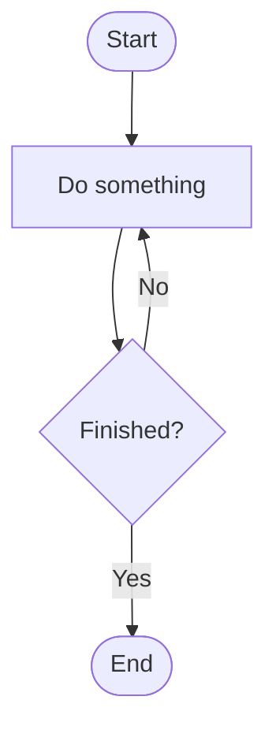
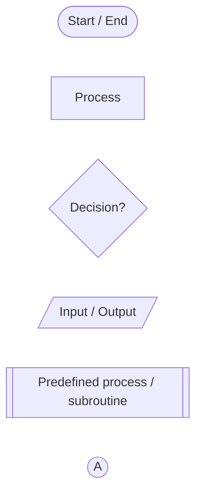
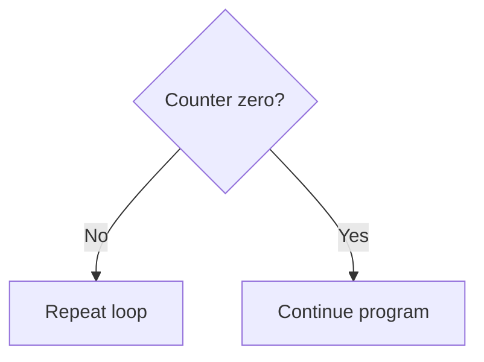
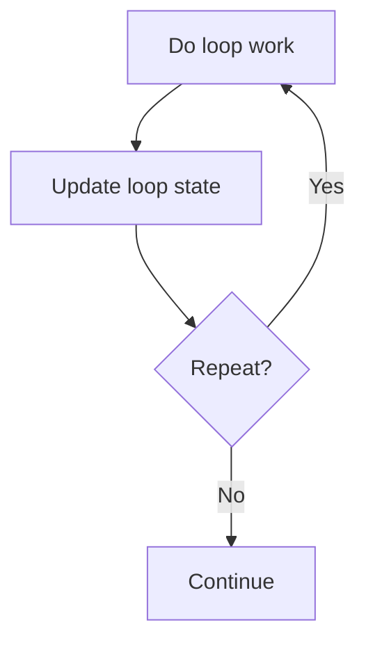
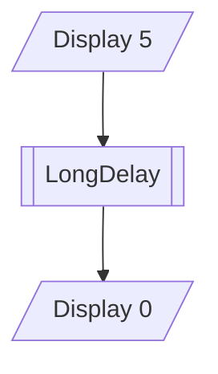
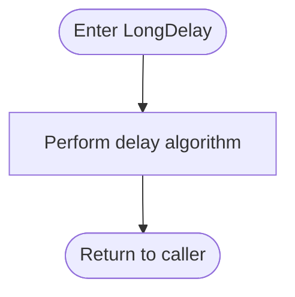
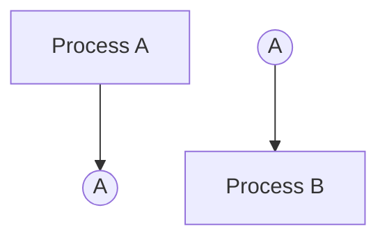

# RCET Flowchart Quick Reference

## 1. RCET rules at a glance

- Show **meaningful algorithm steps**, not English translations of individual source instructions.
- Show the decisions that control program behavior and **label every outcome**.
- Keep the primary flow direction obvious. **Top-to-bottom is preferred**; left-to-right is acceptable when it is clearer.
- Backward or upward arrows should normally communicate **repetition** rather than ordinary forward execution.
- Show setup at the level the assignment is teaching. Later work may summarize setup that is already established.
- A complete flowchart may be a **linked set of readable charts** such as `FC-1`, `FC-2`, and `FC-I1`. Do not shrink a large chart until it is difficult to read.
- Keep flowcharts, pseudocode/TODO notes, comments, and final source consistent.
- An excerpt may explain a local code section, but it does not replace the complete chart set.

See [guide sections 1-8](RCET-Flowchart-Guide.md) for the full expectations.

---

## 2. Mermaid starter and shape lookup

[Open this diagram in Mermaid Live Editor](https://mermaid.live/edit#pako:eNpNz00OgjAQBeCrNLOSBC7AQmNBd7rBjQEWDR1oE9qaMo0xwN3lJya-5fdmMW-ExkmEFNrevRslPLEHryxbcj6UBS1QRyxJjoyXuWODM0hK267eb_hWZeNVWz0olKd592z16e4mxv_hicPE8kN5sbKOKgsxGPRGaAnpCKTQrJ9IbEXoCeYYRCBXfGwDKfmAMYSXFIS5Fp0X5ocoNTl_22dsa-YvwVlEPQ)



`TB` means top-to-bottom. Use `LR` for left-to-right.

### Common shapes

[Open this diagram in Mermaid Live Editor](https://mermaid.live/edit#pako:eNo1j0EPgjAMhf8K6QkSEu5cjIoHEg1E9IQc5lZkCWxkdDGG8N8dDntqv7zX9s3AtUBIoe31m3fMUHC-PlTg6hbWFa0gCU5KNJGnZV0azXGaGj9nc4ZcTlKr3eJJXtRJrka7GgtLrkk2bXU_1M6OAlupUASj3-R0k30abcnRZtMew3AfuZsQw4BmYFJAOgN1OKzfug3M9gRLDMySrj6KQ0rGYgx2FIwwk-xl2PCHKCRpc_FRf4mXL2TpUik)



| Meaning | Mermaid | Use |
| --- | --- | --- |
| Start / end / return point | `A([Start])` | Entry or exit |
| Process | `A[Process]` | Meaningful algorithm action |
| Decision | `A{Decision?}` | Condition that selects a path |
| Input / output | `A[/Read input/]` | Information entering or leaving the algorithm |
| Predefined process | `A[[Subroutine]]` | Separately documented routine/process |
| On-page connector | `A((A))` | Continue at matching visible identifier |

Mermaid does not provide a basic dedicated conventional off-page-reference shape. For printed draw.io or hand-drawn charts, use the conventional off-page connector. In Mermaid, identify the chart/page continuation explicitly.

See [guide section 3.1](RCET-Flowchart-Guide.md#31-the-symbols-you-need-most-often) and [section 9.2](RCET-Flowchart-Guide.md#92-mermaid).

---

## 3. Common flow patterns

### Decision

[Open this diagram in Mermaid Live Editor](https://mermaid.live/edit#pako:eNpNjr0OgkAQhF9lszW8AIUmQqsFWmjQ4sItcgncXta9GAXeXfAnccpvJjMzYM2WMMOm43vdGlE4bM4eZhVDztErCTxJeD19KaTpatzxCGVVUiCj0DGHy797otsIxypnr85HgiB8FdPPGUywJ-mNs5gNqC31y7alxsROcUrQROX9w9eYqURKMAZrlApnloIfJOuUZfs5_v4_vQASj0Oz)



Every decision outcome gets a label. Yes and No have no required physical direction.

### Loop

[Open this diagram in Mermaid Live Editor](https://mermaid.live/edit#pako:eNpNj80KgzAQhF8l7FlfwEOLP9f20J9DsR6CWWuoyUrcIEV996qh0D0N3wzLzAQ1KYQEmo7GupWOxS17WrFeWhYkOqJejOTelYjjg8jKe68kY-ADr7IK6Wz38-mCPUo-LoHmG50fOMwi_SdnmkVR5mRZW7-9gAgMOiO1gmQCbtFspRQ20ncMSwTSM10_toaEnccI_N6j0PLlpPlBVJrJncKifdjyBYldST4)



Show the repeated work, state change, repetition decision, and exit.

### Caller and child subroutine

Caller:

[Open this diagram in Mermaid Live Editor](https://mermaid.live/edit#pako:eJxFjrEKgzAURX8lvFmxS5cMhUrGdqpbmuFhnhowRtIXioj_3lQpveM5F-5doQ2WQEI3hnc7YGTR1M9J5Fx1pdxrHnER58qIsrwIpfUtTL2iDI05amo39b98qrKBAjxFj86CXIEH8t8RSx2mkWErABOHxzK1IDkmKiDNFpmUwz6i_0GyjkO8Hw_3o9sHYEA5jQ)



Child chart:

[Open this diagram in Mermaid Live Editor](https://mermaid.live/edit#pako:eNo1j7sKg1AQRH9l2UpBf8AiRdAuAUnSqcXiXR9wH2HZSxDx3xOVTHmYYWZW7INhLHCw4dNPJAqva-vhpyppKq8scAt-LNnS0qWQ5xeom5plCOLA7BTIjkFmnVx3BuvD9UiaB2sUDxqgJ2tZurT1mKFjcTQbLFbUid3ebnigaBW3DClqeC6-x0IlcobxbUi5nGkUcn_IZtYg93P68WD7AlhsQ7s)



A `CALL`/`RETURN` subroutine resumes its caller. A `GOTO` follows an explicit branch target and does not save a return point. See [guide section 6.4](RCET-Flowchart-Guide.md#64-callreturn-versus-goto).

### Connector

[Open this diagram in Mermaid Live Editor](https://mermaid.live/edit#pako:eNo9jjELwjAUhP9KeFML6aBjByGpqyDoZjs8kldbaBJJXxAp_e9qit529x3HLWCCJaihn8LTDBhZXHXrxUfqdo7B0DwL1YmqOohmVxSqLDfa7LPJQP-bums9SHAUHY4W6gV4IPfdt9RjmhhWCZg4XF7eQM0xkYT0sMh0HPEe0f1CsiOHeNrO5Y_rG3l_Njk)



`C1` and `C2` are different node IDs with the same visible connector label. Mermaid does not connect them automatically; the reader follows the matching label.

---

## 4. Mermaid syntax reminders

```text
flowchart TB                    top-to-bottom
flowchart LR                    left-to-right

A --> B                         flow
A -->|Yes| B                    labeled flow
A -.-> B                        dotted context link

A["Line 1<br/>Line 2"]          manual line break
%% comment                      hidden Mermaid-source comment

subgraph GROUP[Title]           begin visual group
end                             close visual group

style A opacity:0.5             fade context node
```

### Node IDs and labels

In:

```text
readSwitches[Read switches]
```

`readSwitches` is the node ID and `Read switches` is the visible label.

- Give each distinct node its own ID.
- Visible labels may repeat.
- Quote labels containing punctuation or Mermaid-sensitive text.
- Use `<br/>` inside a quoted label for an intentional line break.
- `subgraph` creates visual grouping only. It does **not** imply a call, return, interrupt, or continuation.

See the [guide's Mermaid authoring section](RCET-Flowchart-Guide.md#92-mermaid) or [Appendix A](RCET-Flowchart-Guide.md#appendix-a-mermaid-syntax-lookup) when you need more syntax detail.

---

## 5. Large programs and special cases

| Situation | Quick rule | Guide |
| --- | --- | --- |
| Reusable routine | Show a predefined-process box in the caller and a separate complete child chart. | [6.3](RCET-Flowchart-Guide.md#63-subroutines-and-hierarchical-flowcharts) |
| Same chart runs out of page space | Continue it with matching page/connector identifiers. | [6.6](RCET-Flowchart-Guide.md#66-continuing-a-chart-versus-decomposing-a-chart) |
| Program is naturally several algorithms | Use named charts such as `FC-1`, `FC-2`, `FC-3`. | [6.5](RCET-Flowchart-Guide.md#65-what-complete-flowchart-means-in-rcet) |
| Interrupt service routine | Document it separately, typically `FC-I1`; do not draw an ordinary flow arrow from main execution into the ISR. | [7.1](RCET-Flowchart-Guide.md#71-rcet-convention-for-interrupts) |
| Local code explanation | Use a readable excerpt with entry/exit context and identify the complete source chart. | [8.2](RCET-Flowchart-Guide.md#82-flowchart-excerpts-beside-code-in-the-lab-book) |

A large readable chart is better than a tiny chart. Dedicate a full page or multiple pages when the algorithm needs the space.

---

## 6. draw.io quick workflow

Open the [draw.io editor](https://app.diagrams.net/) and create a blank diagram.

| Task | Action |
| --- | --- |
| Choose symbols | Enable **More Shapes → Flowchart → Apply**. |
| Label | Use short algorithm descriptions. Use **Shift+Enter** for a manual line break. |
| Connect | Attach connectors to shapes and label decision outcomes. Keep routes easy to follow. |
| Arrange | Use **Arrange** controls to align and size shapes consistently. |
| Multiple charts/pages | Name charts and pages and match continuation markers. A page or group does not create a call/return relationship. |
| Publish | Save the editable source, then check print size or export a readable image/PDF when the lab book needs it. |

Full draw.io instructions and official links are in [guide section 9.1](RCET-Flowchart-Guide.md#91-drawio--diagramsnet).

### Hand drawn

Hand-drawn charts are acceptable. Use a straightedge for straight lines, make symbols clean and consistent, and give the drawing enough page space. A flowchart stencil/template can help. See [guide section 9.3](RCET-Flowchart-Guide.md#93-hand-drawn-flowcharts).

---

## 7. When Mermaid fights the layout

First decide whether the problem is the **diagram layout** or the **program flow**.

For a layout problem, try this order:

1. keep one primary direction, normally `TB`;
2. shorten labels and/or add line breaks;
3. put meaningful routines/processes in separate charts;
4. reduce crossing dependencies;
5. try `LR` when it fits naturally;
6. use draw.io when exact placement matters.

If the chart needs many jump labels, connector pairs, or distant branches just to explain ordinary execution, inspect the code structure before adding more routing devices to the drawing.

See [guide section 6.4.4](RCET-Flowchart-Guide.md#644-when-tangled-flow-calls-for-refactoring) and [section 9.2.9](RCET-Flowchart-Guide.md#929-when-mermaid-fights-the-layout).

---

## 8. Final check

Before calling the flowchart finished:

- [ ] Every decision outcome is labeled and traceable.
- [ ] Loops repeat and exit at the correct places; calls return to the correct caller.
- [ ] Flowchart labels describe algorithmic purpose and agree with pseudocode, comments, and final source.
- [ ] Every chart is readable at actual lab-book size, and excerpts identify their complete chart.
- [ ] Mermaid renders correctly in the intended Markdown viewer and each Live Editor link still opens the same diagram source.

A successful render checks syntax. **Manually trace the behavior too.**

See [guide section 5.1](RCET-Flowchart-Guide.md#51-manually-trace-the-chart) and the full [flowchart checklist in section 8.4](RCET-Flowchart-Guide.md#84-flowchart-checklist).
